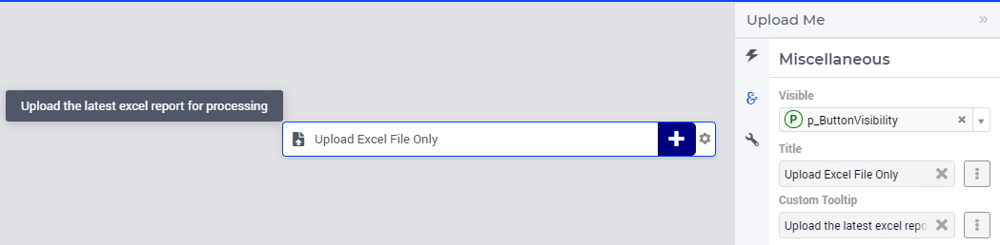
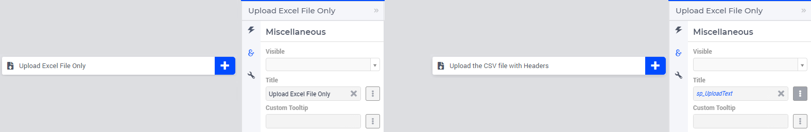
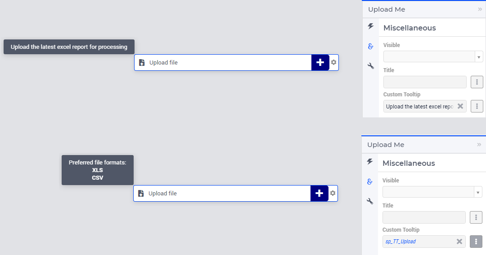

Upload Widget
=============

The Upload widget and the related :doc:`download-widget` achieve complementary tasks.

.. image:: images/Upload-View.png
    :align: right

By using the Upload Widget the end-users can upload a file to the AIMMS application, which can be further processed by the AIMMS model. 
This is very useful for applications which depend to a significant extent on input data provided by the users (e.g. an Excel file with a pre-determined template). 

.. warning::
   
   There is a hard-coded **limit of 128 MB for upload files** in the AIMMS Webserver component! In particular, exceeding this limit will result in an error while attempting to upload a file using the upload widget.
   
   This limit can be changed (i.e. to a value lower than 128 MB) by adding (or adapting, if it already exists) a ``.conf`` file in you project settings folder (``MainProject\WebUI\settings\webui-options.conf``). 
   In this file you can set a value for the following option (here the limit of 128 MB is used, for illustration): ``webui.webuiserver.max-request-body-size 134217728``.

   Also, please be aware that there is a default upload time-out of 5 minutes (i.e. 300 seconds). This can be overruled in the ``.conf`` file, by adding or adapting the option ``webui.webuiserver.max-session-idle-seconds``.
   Some precaution should be taken in order to check whether your file can be uploaded within the specified time-out. 
   
Creating an Upload Widget
-------------------------

After adding a new Upload widget to your WebUI page, you need to link it with an AIMMS procedure using the options editor of the Upload widget. This procedure needs to have three arguments in the exact way as below. 

.. code::
    
    Procedure MyFirstUploadProc {
        Arguments: (FileLocation,StatusCode,StatusDescription);
        StringParameter FileLocation {
            Property: Input;
        }
        Parameter StatusCode {
            Property: Output;
        }
        StringParameter StatusDescription {
            Property: Output;
        }
    }

.. warning::

   The latter two (output) arguments should have the exact names shown above as they are treated in a special way in the underlying procedure call mechanism.

    
FileLocation
^^^^^^^^^^^^

The upload widget always copies the file to be uploaded to a location depending on which AIMMS environment you are using. ``FileLocation`` contains the name of the uploaded file. 

* the root folder of the AIMMS project if in Developer mode 
* the temporary PRO folder, if the app is launched from a PRO server (or AIMMS Cloud)

However, to access this uploaded file with name ``FileLocation`` in the temporary PRO folder, you will need to know the path of that "PRO temporary" folder and append it before the file name. This can be done by using the pre-defined function ``webui::GetIOFilePath`` after assigning a string value to ``FileLocation``.

.. code::

   webui::GetIOFilePath(FileLocation);

The above function returns a string value with the absolute path to the file ``FileLocation`` if you are using it from PRO and returns the unchanged file name if you are in Developer mode. By using this returned value as the location for the file you just uploaded, you will make it available for your model.

.. note::

    In case you want to be able to download a previously uploaded file through the download widget, you can copy that file into the appropriate location. For this you can use the function :any:`FileCopy` as shown below: 

    .. code::

      FileCopy(FileLocation, webui::GetIOFilePath(FileLocation));
    
StatusCode
^^^^^^^^^^

The ``StatusCode`` argument should be filled in as follows:

.. code::

    statusCode := webui::ReturnStatusCode('OK');

The pre-defined function ``webui::ReturnStatusCode`` has as possible arguments the ones shown below:

    * ``OK``
    * ``CREATED``
    * ``BAD_REQUEST``
    * ``UNAUTHORIZED``
    * ``CONFLICT``
    * ``ERROR``
    
As your widget is expected to upload a file, the status ``OK`` is expected if all goes well. You can use one of the other status codes to signal that something went wrong when creating your file.

.. note::

   Please note that these status codes are standard HTTP status codes. For further reference, please visit the following site https://en.wikipedia.org/wiki/List_of_HTTP_status_codes 
    
StatusDescription
^^^^^^^^^^^^^^^^^

The ``StatusDescription`` argument can be used to display custom text as the status messages in the Upload widget. 

Example
-------

An example for the body of the Upload procedure is shown below. This particular example shows how to upload and read a text file. An example AIMMS project which illustrates the usage of this procedure can be downloaded from :download:`here <resources/DownloadWidgetExample.7z>`.

.. code::

   ! we store the location of the file in string parameter UploadLocation 
   UploadLocation := webui::GetIOFilePath(FileLocation); 
   
   ! reading the file UploadLocation into an string parameter
   sp_TextOfUploadedFile := FileRead(UploadLocation); 

   ! checking if the previous read statement was successful or not
   if sp_TextOfUploadedFile <> '' then 

      ! if successful, statusCode is set to 'OK' which will trigger the WebUI to show the message below in a grey box
      StatusCode := webui::ReturnStatusCode('OK'); 

      ! displaying the status message, and logging it in the WebUI messages
      StatusDescription := "File was uploaded and read successfully"; 
      
   else    !if previous read statement was not successful 
      
      ! setting the statusCode to 'ERROR' 
      statusCode := webui::ReturnStatusCode('ERROR'); 

      !displaying a custom error message 
      statusDescription := "Could not read the file or the file is empty."; 
      
   endif;

When executed through the upload widget, this procedure will let you upload a file at ``UploadLocation`` and read it in a string parameter ``sp_TextOfUploadedFile``. 

The name of the uploaded file will be appended with a random "big" number, to be sure to not overwrite any other file on the server. 
If you've uploaded "*MyExcel.xlsx*", the uploaded file name could be "*MyExcel-1564733452728.xlsx*".

If launched from PRO, the file name will still remain the same but the value for UploadLocation will be "temporary PRO path + MyExcel-1564733452728.xlsx".

Note that this uploaded file is NOT automatically deleted if you are running WebUI in AIMMS Developer mode. If you want to delete this file after an upload, you should use the function :any:`FileDelete` as shown below: 

.. code::

   FileDelete(UploadLocation)

This step is not required on PRO as the temporary PRO folder in which the file is created will be automatically deleted sometime after the session is ended. 

.. tip::

	If you need to use folder names in your model, use forward slashes to separate them. This ensures that your project will be able to be executed on a Linux server.

Miscellaneous
-------------

In the Miscellaneous tab of the Upload widget's options editor, other options may be set that are explained below: 

\

Visibility
^^^^^^^^^^

You can control the visibility of the upload widget by either specifying a literal value 1 (visible) or 0 (hidden) or a binary parameter.

Title
^^^^^

Set the display text on the upload widget here. By default, the text that is displayed is "Upload File". You can specify either a literal value like "Upload Excel File Only" or a string parameter.

.. _upload-widget-custom-tooltip:

\

Custom Tooltip
^^^^^^^^^^^^^^

You can specify a custom tooltip to display more information when the user hovers over a respective button. You can specify either a literal value like "Upload the latest excel report for processing" or a string parameter.

The content for the string parameter can be data driven and also supports HTML. 

As illustrated below, the definition of string parameter ``sp_TT_Upload`` used to specify the ``Custom Tooltip`` option.

.. code:: 
    
    formatstring("Preferred file formats:  <strong> XLS </strong> <strong> CSV </strong>");

\

Alternative to the Upload Widget
---------------------------------

.. note::
    
   Starting from AIMMS 24.3 uploading a file to the AIMMS application can be achieved by using the dedicated procedure ``webui::RequestFileUpload`` declared in the `WebUI Library <library.html>`__. This procedure can be called in the WebUI, for example, behind a button, a page action, a widget action, or an item action. 