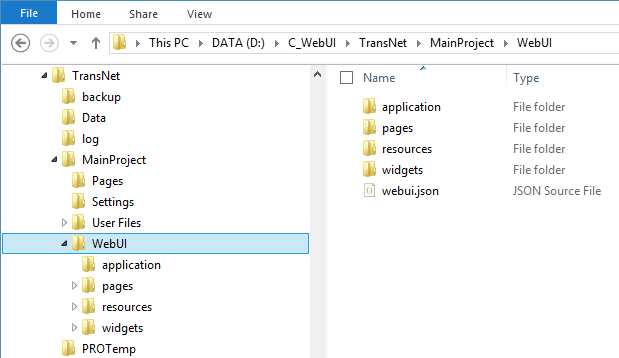

WebUI Folder
************

An AIMMS WebUI-ready application is an AIMMS application with a Web User Interface built on top of it. In particular, this means that the application directory contains a *WebUI* subfolder in the *MainProject* folder (this folder is created automatically when `starting WebUI <publishing.html>`_ for the first time). 

The description of the various topics related to the WebUI folder can be accessed using the following navigation scheme:

.. toctree::

   webui-json
   resources-subfolder
   css-styling
   units-support
   multi-language

