WebUI Grid Pages 
================

.. |page-manager| image:: images/PageManager_snap1.png

.. |dots| image:: images/PageManager_snap3.png

.. |pencil| image:: images/PageManager_snap3_1.png

.. |eye| image:: images/PageManager_snap3_2.png

.. |hidden| image:: images/PageManager_snap3_3.png

.. |bin| image:: images/PageManager_snap3_4.png

.. |home| image:: images/PageManager_snap3_5.png

.. |wizard| image:: images/PageManager_snap3_6.png

.. |plus| image:: images/plus.png

.. |kebab|  image:: images/kebab.png

.. |addpage|  image:: images/addpage.png

.. |sidepanel|  image:: images/sidepanel.png

.. |dialog|  image:: images/dialogicon.png 

This section describes various tasks related to WebUI grid pages.

.. important::

	Grid WebUI pages are available starting from the AIMMS software version 4.75 on.

Grid pages introduce in AIMMS WebUI the CSS Grid concept of visualization based on page layouts, which is currently a widely used standard in webdesign. For more information on CSS Grid in general please see websites such as:

    * `MDN Web Docs <https://developer.mozilla.org/en-US/docs/Web/CSS/CSS_Grid_Layout>`_
    * `w3schools.com <https://www.w3schools.com/css/css_grid.asp>`_
    * `css-tricks.com <https://css-tricks.com/snippets/css/complete-guide-grid/>`_
    * `learncssgrid.com <https://learncssgrid.com/>`_
    * `gridbyexample.com <https://gridbyexample.com/>`_
	
	
The CSS Grid concept features several advantages such as better responsiveness, fluid layouts, and the possibility for full page widgets. What is taken out compared to the classic WebUI pages is the repositioning of all widgets when the browser window is resized. The intention is to support moving an entire WebUI application to this grid page format, such that this may be achieved gradually, by converting one page at a time (the idea is that the classic WebUI page style will become obsolete and will be deprecated in time).

When a page layout is applied to a grid page, the page is divided into a number of rectangular areas and each area is to host a group of widgets. In order to become visible on a grid page, each widget on that page must be assigned to one of the areas defined by the page layout. Currently, all the standard layouts use so-called fractions for resizing. This way, the layout areas always preserve their relative size and position on the page, even when the entire browser window is being resized. However, Grid supports more options for (re)sizing like pixels, percentages or em’s, and also supports combinations of those. These options can already be used in custom layouts, please see further below in this section for more details. 

The organization of a page and the widgets on the page by using page layouts is currentlt supported by dedicated functionalities in the WebUI Page Manager.

Page Manager with Grid Pages
----------------------------

When opening the Page Manager two tabs are now available: the App tab and the Page tab. The App tab shows the list of all the pages in the application:

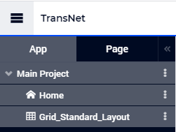

The actions for adding, renaming, moving, changing the visibility, and deleting a grid page in the Page Manager are the same as for a classic page. In particular, adding a new grid page can be done by selecting the grid icon in the page (create) options:

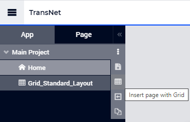

Once a page has been selected in the App tab of the Page Manager, the Page tab shows more details about that particular page:

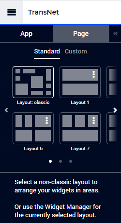
	
The upper part of the Page tab allows the user to select a certain layout for the page, either as one of the Standard layouts or as a Custom layout. First we are going to discuss options for applying Standard layouts. Afterwards, we will also discuss relevant topics for using Custom layouts. 

Standard Layouts
----------------

As shown in the last picture above, a particular case of a standard layout is the "Layout: classic". When this layout is applied to a grid page, then there are actually no specific areas defined and the widgets are placed on the page in the same way as done for a classic page. Resizing the entire browser window will result in the same repositioning of the widgets as the one applied to the classic pages.

The user may choose to switch to another layout from the standard list. Currently this list offers Standard Layout A1, A2, A3, A4, Standard Layout B1, B2, Standard Layout C1, C2, and Standard Layout D1, D2 (please use the left arrow < and the right > in order to scroll horizontally through the list):   

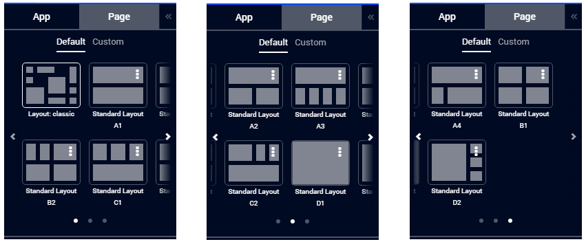
	
For example, if we choose the Standard Layout B2 for a newly added grid page Grid_Standard_Layout in our TransNet application and add widgets for input and output data as explained in the "Getting Started" section, then we may assign widgets to the five areas Main, Aside A, Aside B, Aside C, and Aside D as shown in the following pictures:

.. image:: images/GridPage_PageTab_Full_1.png
    :align: center
	
Initially, unassigned widgets may be moved from the "Unassigned widgets" section to one of the defined areas by using drag-and-drop. Assigned widgets may also be moved from one area to another by using drag-and-drop:

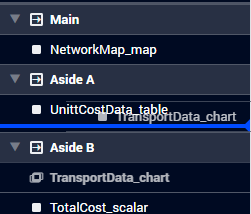

The icon before the name of an area contains either a horizontal arrow from left to right, or a vertical arrow from top to bottom. These arrows indicate how the widgets are distributed within each area, either columnwise in equal columns or rowwise in equal rows, which is also indicated by the corresponding tooltip:

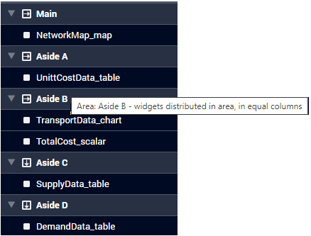

Please also note the "+" sign at the bottom of the Page tab of the Page Manager. This allows the user to add a new widget to the selected page directly from within this Page tab, without the need to open the Widget Manager in order to access the same functionality.  

The layout selection and the assignments of widgets to areas as shown above results in the following page visualization:

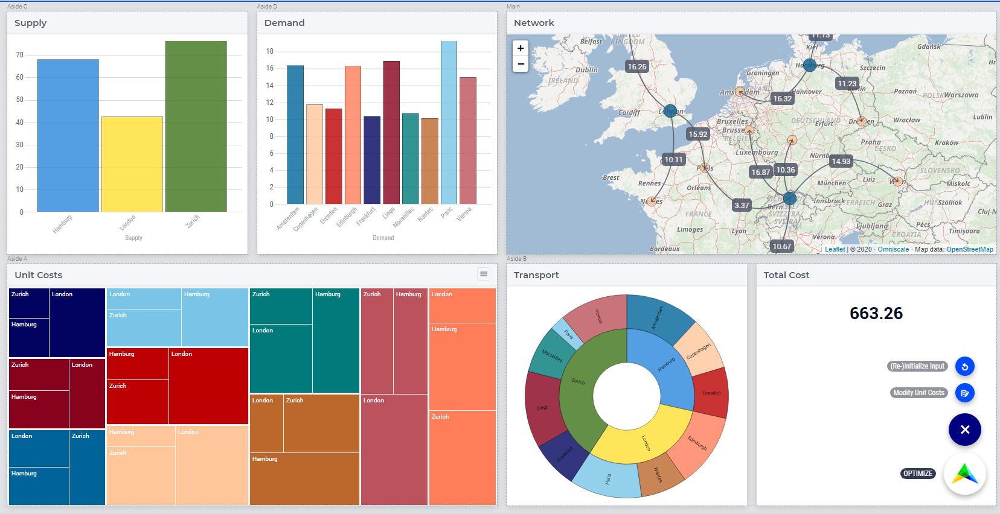

Note that the area "Aside B" is here in the lower right part of the page and contains the two widgets for Transport and Total Costs values, which are distributed columnwise in equal columns.

Switching between Layouts
-------------------------

When the user switches to another layout , for example to Standard Layout C1, then the widgets stay assigned to areas with the same name, if these areas exist in the newly selected layout. If not, then the corresponding widgets appear in the "Unassigned widgets" section and may be moved by drag-and-drop to one of the currently available areas, if required:

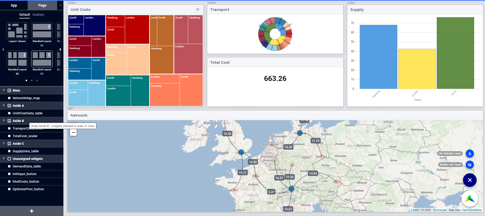

In this example, the Demand widget (which used to be assigned to area "Aside D" in the Standard Layout B2) has been moved to "Unassigned widgets" section (because the area "Aside D" is not defined in the Standard Layout C1).
Also, the distribution of widgets in area "Aside B" is now rowwise in the current Standard Layout C1 (whereas it used to be columnwise in the Standard Layout B2).

In general, widgets will always remember which named area they were assigned to, also upon switching layouts. Only when you explicitly move a widget to another area, will they store their new assignment. In other words, one can switch layouts without breaking the assignments of the widgets, as long as one does not re-arrange them.

As apparent from this example, the standard layouts provide some convenient basic options to start with. However, specific requirements for a page may require the usage of a Custom page layout.

Custom Layouts
--------------

A new custom layout may be added by using the corresponding "+" button in the Custom section of the Page (layout) tab or by cloning one of the standard layouts (which is to be modified afterwards):

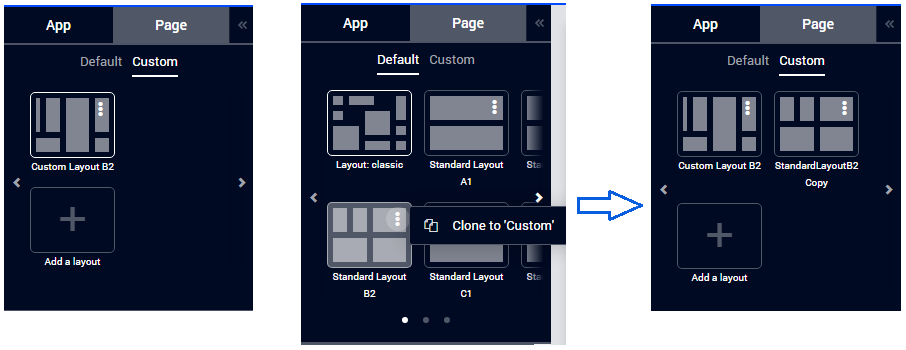

A custom layout may be edited (i.e. modified) by using the Edit option in its upper right corner:

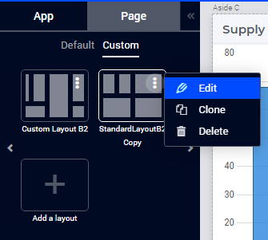

This will open the layout Editor where the layout name and format may be adjusted and then saved:

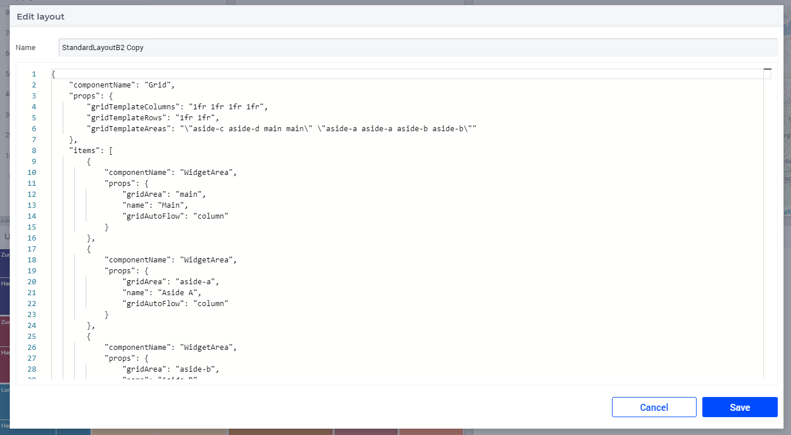

In particular, the editor contents above describes a layout with 4 columns and 2 rows. We can modify this layout and save the modified layout under the name "Custom Layout B2", for example, as follows:

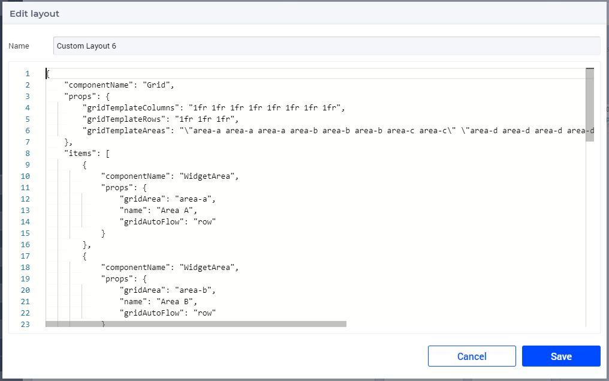
	
Note that in this case the grid has 8 columns and 3 rows (instead of 4 columns and 2 rows as it used to have initially). Also a new (sixth) area "Aside E" has been added to the layout:

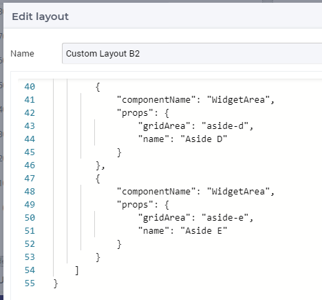

Clearly, this new area "Aside E" is used when defining the adjusted grid template areas in the modified layout format:

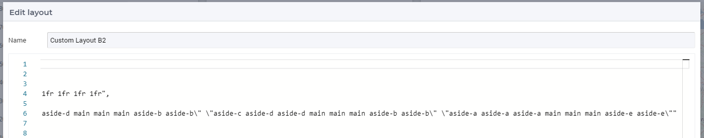

When we apply the resulting custom layout as defined above to our page, the resulting visualization is as follows:

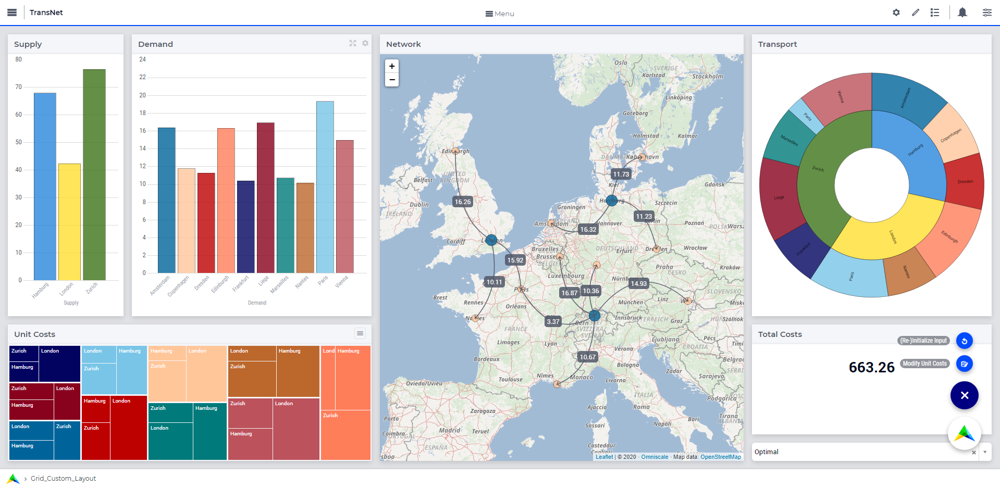

This resulting page looks better than the one achieved only based on the Standard Layout B2 discussed above. In particular, we have gained more space for the map widget such that the network is better visible now. Also, this page preserves the clear division between the input, optimization, and output data in a similar way as discussed in the "Getting Started" section of this manual. 

Creating Grid Definitions
+++++++++++++++++++++++++

This section provides more details about creating (custom) grid layouts using the layout editor exemplified above.

.. warning::

	The special layout editor will only save valid layout definitions. The description of a (custom) grid layout created using the layout editor will be saved in the ``webui.json`` file mentioned in the `WebUI Folder <webui-folder.html>`_ section. Please DO NOT change this layout description in the ``webui.json`` directly. In particular, do not change any layout property names manually in the ``webui.json`` file. Failure to comply with this rule may lead to unexpected results. For more details, please check also the last two sub-sections below.

A layout is a technical description of a specific component (Grid), its properties and the items (sub-components) which live within that component. We currently (only) support Grid as the main component and WidgetArea as the sub-components.

The properties of the Grid component are closely related to how CSS Grid works (see websites links in the beginning of this section). In AIMMS WebUI we currentlty support grid-template-rows, grid-template-columns and grid-template-areas. By combining these you get virtually all of the power of CSS grids, using your choice of fractions, fixed pixel sizes or percentages. The gridTemplateAreas then serves to tell how your areas are supposed to overlap with the positions you made available as rows and columns.

Please note that the format you see in the layout editor will serve to create real CSS. This is also the reason why the gridTemplateAreas need to contain the quotes in their escaped version. The output of that needs to be a set of row definitions, grouped between quotes, while the property itself is also a string in quotes (the outer ones).

.. warning::

	The names you give to your areas should re-appear as WidgetAreas components below the items of the Grid. The "gridArea" properties of it should be the same as of one of the defined areas in "gridTemplateAreas" of the Grid. Failure to do so may lead to unexpected results.

Only the areas that you define as sub-components will end up in the Page Configurator tab of the Page Manager, ready to be used to place your widgets in, so please keep these two in sync when you change the (CSS) names or the number of areas of your custom layout.

WidgetArea components support a number of properties:

-	gridArea: the CSS name you also used in the definition of gridTemplateAreas for the parent Grid component,
-	name: the display name you will see in the Page Configurator (which can contain whitespace and 'odd' characters, unlike the gridArea names; see the CSS grid specification),
-	gridAutoFlow: either "row" or "column". It defaults to "column", if not specified. When multiple widgets are placed in this area, this property determines whether the widget either shares space vertically (=row, so stacked widgets) or horizontally (=column, so distribute width).Note that when widgets are stacked, certain widgets will never increase their height beyond their inherent size. For example: buttons, up/download widgets, scalar widgets.
-	runIntoGridGap: true or false. It defaults to false. This property will make an area 'expand' into its gridgap/margins in all directions, so probably best used in combination with one single area. The adjacent areas which are also running into their grid gap will simply overlap.
-	separateFixedHeightWidgets: true or false. It defaults to false. This property triggers different sizing and ordering behavior for the fixed-side widget mentioned above. Those widgets will be grouped together and placed at either the far right (column based flow) or bottom (row based flow) of all widgets. This is slightly different from just grouping your widgets yourself, especially for the column-based flow where you can have a group of vertically stacked buttons on the far right without having to create a new area for that.

We also support most other css-grid-spec properties for either Grid or WidgetAreas, like grid-gap, dir, z-index and several alignment properties, but do note that our own styling will either heavily influence or overrule these. Therefore, please consider their usage as experimental.

Different types of Custom Layout
++++++++++++++++++++++++++++++++

The previous explained the general framework for creating custom layouts. The following sections illustrate more specifically how to use pixels (px) or percentages (%) in order to set a fixed width or height to columns or rows in your layouts.

This is useful when you either require a vertical scrollbar or in some cases a horizontal scrollbar, or if you do not want to use the full height or width of your viewport.

To control the height of your application either to a fixed height or to introduce a vertical scrollbar you need to customize the values in `gridTemplateRows` i.e. for the rows. 

To control the width of your application either to a fixed width or to introduce a horizontal scrollbar you need to customize the values in `gridTemplateColumns` i.e. for the columns. 

Using pixels (px)
+++++++++++++++++

In order to use pixels, you might want to first determine the height (in pixels) of the browser viewport. 

.. image:: images/viewport.png
    :align: center
    :scale: 75

When you use the Workflow Panel and the Side Panels, your viewport size is slightly smaller as illustrated in the image below:

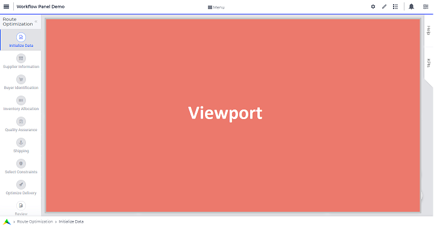

Once you know the height of the viewport, if you want to fix the height of your application to half of your viewport's size, for example, just divide the values such that the sum of the values defining the height of the rows is half of the height of the viewport.

To illustrate the above example, let's consider that the height of the browser viewport is 1000px. In this case, the specification of the `gridTemplateRows` could be, for instance, as follows: 

.. code::

    "props": {
		"gridTemplateColumns": "2fr 1fr 1fr",
		"gridTemplateRows": "100px 100px 300px",
		"gridTemplateAreas": " \"Title Title Extra\" \"Data Data Data\" \"Map Output Optimize\" "
	},

As long as the sum of the values used to divide the rows does not exceed the browser viewport, no scrollbar will appear. To introduce a vertical scrollbar the sum needs to exceed the browser viewport height.

So, assuming again that the viewport height is 1000px, if you want to introduce a vertical scrollbar you can use a code snippet such as the following:

.. code::

    "props": {
		"gridTemplateColumns": "2fr 1fr 1fr",
		"gridTemplateRows": "300px 400px 500px",
		"gridTemplateAreas": " \"Title Title Extra\" \"Data Data Data\" \"Map Output Optimize\" "
	},

Now let's consider the situation where the width of the browser viewport is 1000px.

Similarly as above, for fixing the width such that the layout is half of the browser viewport, just divide the values such that the sum of the values used to divide the columns is half of the viewport's width:  

.. code::

	"props": {
		"gridTemplateColumns": "100px 200px 200px",
		"gridTemplateRows": "1fr 1fr 1fr",
		"gridTemplateAreas": " \"Title Title Extra\" \"Data Data Data\" \"Map Output Optimize\" "
	},

If you want to introduce a horizontal scrollbar you can use a code snippet like the one below, where the sum exceeds the browser viewport width:

.. code::

	"props": {
		"gridTemplateColumns": "300px 500px 500px",
		"gridTemplateRows": "1fr 1fr 1fr",
		"gridTemplateAreas": " \"Title Title Extra\" \"Data Data Data\" \"Map Output Optimize\" "
	},

Using percentages (%)
+++++++++++++++++++++

Similar to the case of pixels, in order to avoid a scrollbar when using percentages the sum of the values should not exceed 100%, and if you want a scrollbar then the sum must exceed 100%.

To illustrate an example where you want to avoid scrollbar or want the application to be half the size of the browser viewport, you can use a snippet such as below:

.. code::

    "props": {
		"gridTemplateColumns": "2fr 1fr 1fr",
		"gridTemplateRows": "10% 20% 20%",
		"gridTemplateAreas": " \"Title Title Extra\" \"Data Data Data\" \"Map Output Optimize\" "
	},

If you want to introduce a vertical scrollbar you can use, for instance, this snippet below:

.. code::

    "props": {
		"gridTemplateColumns": "2fr 1fr 1fr",
		"gridTemplateRows": "10% 40% 80%",
		"gridTemplateAreas": " \"Title Title Extra\" \"Data Data Data\" \"Map Output Optimize\" "
	},

Similarly, if you want to control the width of the application, to avoid a horizontal scrollbar or use only half the width of the viewport you can use the below snippet.

.. code::

	"props": {
		"gridTemplateColumns": "10% 20% 20%",
		"gridTemplateRows": "1fr 1fr 1fr",
		"gridTemplateAreas": " \"Title Title Extra\" \"Data Data Data\" \"Map Output Optimize\" "
	},

If you want to introduce a horizontal scrollbar you can use a snippet such as the following: 

.. code::

	"props": {
		"gridTemplateColumns": "10% 40% 80%",
		"gridTemplateRows": "1fr 1fr 1fr",
		"gridTemplateAreas": " \"Title Title Extra\" \"Data Data Data\" \"Map Output Optimize\" "
	},

However, there is one fundamental difference between using pixels and percentages: pixels are fixed width/height regardless of the browser viewport size, whereas percentages adjust according to the browser viewport size since it adapts to the percentage of the size of the browser viewport.

Using combinations of fr, px, and %
+++++++++++++++++++++++++++++++++++

You can also use a combination of fractions and pixels and percentages. This is typically useful when you might want to fix the size of a particular row or column but not restrict the rest of the layout.

The snippet below illustrates the use of fractions (fr) and pixels (px), where the first and second columns have a fixed width of 200px each, and the first row has a fixed height of 100px. This will result in the `Title` and `Extra` areas having a fixed height of 100px and the `Map` area with a width of 400px. 

.. code::

	"props": {
		"gridTemplateColumns": "200px 200px 1fr 1fr",
		"gridTemplateRows": "100px 2fr 1fr",
		"gridTemplateAreas": " \"Title Title Title Extra\" \"Data Data Data Data\" \"Map Map Output Optimize\" "
	},

.. note::
	Fractions (fr) and percentages (%) are essentially the same since they are a measure of proportion.

Syntax and Semantics
++++++++++++++++++++

It is important to understand some of the syntax and semantics of the JSON used to create custom layouts.

#. Please ensure the structure is intact. It should follow the structure below:

		.. code::
				
				{
					"componentName": "Grid",
					"props": {
						"gridTemplateColumns": "NUMBER OF COLUMNS AND PROPORTIONS",
						"gridTemplateRows": "NUMBER OF ROWS AND PROPORTIONS",
						"gridTemplateAreas": "AREA-NAMES WITH DIVISIONS/LAYOUT"
					},
					"items": [
						{
							"componentName": "WidgetArea",
							"props": {
								"gridArea": "AREA-NAME",
								"name": "DISPLAY OF AREA-NAME IN THE LAYOUT",
								"gridAutoFlow": "ORIENTATION OF WIDGETS"
							}
						}
					]
				}

	Examples of what can be changed:

		* NUMBER OF COLUMNS AND PROPORTIONS: "1fr 1fr" : Two columns with equal proportions.
		* NUMBER OF ROWS AND PROPORTIONS: "1fr 1fr" : Two rows with equal proportions.
		* AREA-NAMES WITH DIVISIONS/LAYOUT: " \"Area-A Area-A\" \"Area-B Area-C\" " : The first row and both columns are assigned to the same area i.e. "Area-A". The second row has two areas one for each column i.e. "Area-B", and "Area-C".
		* DISPLAY OF AREA-NAME IN THE LAYOUT: Area-A, Area-B and Area-C : This property is case sensitive. Use the exact names used in AREA-NAMES WITH DIVISIONS/LAYOUT here as well. Also, each area needs to be defined separately.
		* ORIENTATION OF WIDGETS: "row" or "column" : Use "row" if you want the widgets to appear one on top of the other and use "column" if you want widgets to appear side by side. This property is case sensitive as well.

#. In the ``props`` section, only change the values for ``gridTemplateColumns``, ``gridTemplateRows``, and ``gridTemplateAreas``, as explained above.

#. While defining "``gridTemplateColumns`` and ``gridTemplateRows`` no spaces should be given between the numeric and measure of proportionality. eg: 1fr, 50px, 20%.

	.. image:: images/PageV2_RightWrongDivisions.png
    		:align: center

#. To understand the ``gridTemplateAreas`` refer to the illustration below:

	.. image:: images/PageV2_TemplateAreasExplanation.png
    		:align: center

	The above illustration results in the below layout.

	.. image:: images/PageV2_TemplateAreasPreview.png
    		:align: center

Troubleshooting
+++++++++++++++

If you are not able to get your desired output you might want to check a few aspects for troubleshooting: 

* Check if you have defined all the areas that you used in "gridTemplateAreas".
* Check if your division matches the rows and columns and if the grouping is correct.
* Check if the values in "gridArea" used to define each area has the correct case sensitive names.
* Check if there are no spaces in "gridTemplateColumns": "1fr", and "gridTemplateRows": "1fr 1fr", between the numeric and measure of proportion.
* Check for errors in the JSON using a JSON Parser. You can use one of the links here. `Link 1 <http://json.parser.online.fr/>`_ or `Link 2 <https://jsonparseronline.com/>`_.

  

