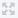
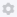
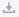
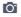

Widget Header Bar
*****************

.. |widget-action| image:: images/widget-actions-new.png
.. |widget-action-nohover| image:: images/widget-actions-new-nohover.png
.. |filtered-icon| image:: images/filtered_icon.png
.. |table-filtered| image:: images/headerfiltered_icon.png

All Widgets have a header bar, consisting of several options and the widget title. 

.. image :: images/WidgetHeader_SimpleHeader.png
    :align: center

Title, Full Screen and Settings
===============================
Some of the options are specific to certian widgets but almost all widget have a Title, Full Screen |full-screen| and Settings options |widget-settings|.

The **Title** for the widget can be specified in the ``Title`` option under the `Miscellaneous <widget-options.html#miscellaneous>`_ section of the `Widget Options <widget-options.html>`_.

The |full-screen| icon expands the respective to a full screen mode. Clicking on the icon again returns the widget to the original size.

.. image :: images/WidgetHeader_Normal.png
    :align: center

.. image :: images/WidgetHeader_FullScreen.png
    :align: center

The |widget-settings| icon option the `Widget Options <widget-options.html>`_ where you can specify contents, pivoting, and other options for the widget. 

Below are some of the other icons you will see in the Widget Header if they are configured.

Download Image - PNG |download-image|
=====================================

.. note :: 	Download Image - PNG is available starting from the AIMMS software version 4.79 onwards as part of `Experimental Features <experimental-features.html>`_. Please visit the `Experimental Features <experimental-features.html>`_ page on how to enable the feature.

This option allows users to save a snapshot of the widget to their disk.

Download Image is available for `Table <table-widget.html>`_, `Bar Chart <bar-chart-widget.html>`_, `Line Chart <line-chart-widget.html>`_, `Bar-Line Chart <bar-line-chart-widget.html>`_, `Gantt Chart <gantt-chart-widget.html>`_, `Bubble Chart <bubble-chart-widget.html>`_, `Pie Chart <pie-chart-widget.html>`_, `Tree Map <tree-map-widget.html>`_, and also for the Full Page.

To save an image for the full page you currently are on click the |download-image| in the Application Menu Bar.

When downloading the image, the widget title is taken as the filename. In the case that no title is specified for the widget, then the filename is the chart type (eg. barchart.png).

This options is also available when the widget is toggled to the full screen mode.

.. note::

    When downloading the image for a Table on the viewable area is saved and not the entire table.

    The Gantt Chart does not support the scrollable area when downloading the image. 

    For both these cases try expanding the widget to full screen mode and then downloading the image.

Download CSV |download-csv|
===========================

You can save the table data to a ``.csv`` file by using the `Download Table Data <table-widget.html#id1>`_ functionality. 

This option is available only for the Table widget.

Widget Actions |widget-action|
==============================

When `Widget Actions <widget-options.html#widget-actions>`_ are specified for the widget the |widget-action| icon is displayed so the user can access the actions.

Widget Actions can be configured for the `Table <table-widget.html>`_, `Bar Chart <bar-chart-widget.html>`_, `Line Chart <line-chart-widget.html>`_, `Gantt Chart <gantt-chart-widget.html>`_, `Bubble Chart <bubble-chart-widget.html>`_, `Pie Chart <pie-chart-widget.html>`_, `Tree Map <tree-map-widget.html>`_, `Multiselect <selection-widgets.html>`_, `Slider <slider-widget.html>`_, `Legend <selection-widgets.html>`_, `Map <map-widget.html>`_ and `Scalar <scalar-widget.html>`_ (except in Compact Mode) widgets.

Filtering |table-filtered|
==========================

When a user applies `Data Filtering on the Table <table-widget.html#data-filtering-on-the-table>`_, the |table-filtered| icon is displayed in the header of that respective table widget.
