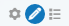
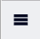
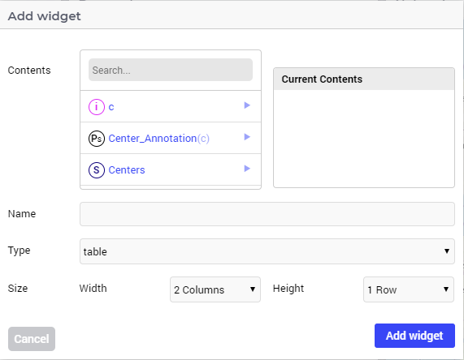
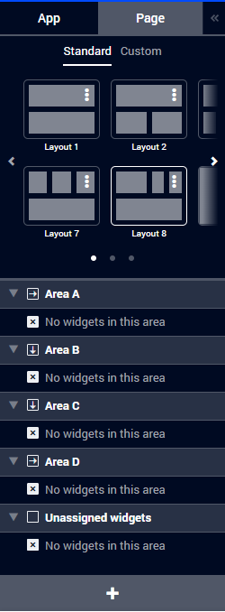
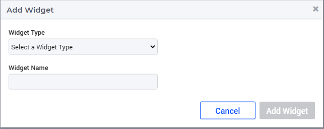
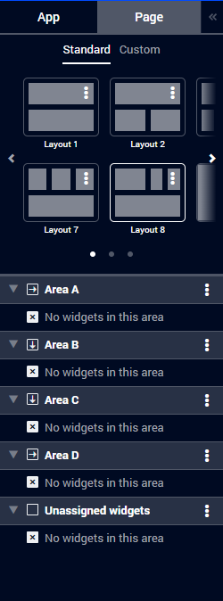
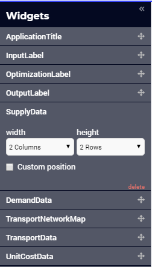

Widget Manager
**************

.. |pencil-grey| image:: images/pencil-grey.png

.. |kebab| image:: images/kebab.png

The way to add a new widget to your WebUI page has changed over time. On this page, all manners to do it are described, along with the AIMMS versions to which those are applicable.

Adding a widget (up to AIMMS 4.74)
==================================

In order to put a new widget on your page:

* Press the Widget Manager button |pencil-only| next to the page title |pencil-black|.
* The widget manager will open from the left. This widget manager lists all widgets that are present on the page. 
* By pressing the big |plus-add-widget| at the bottom of this list, the Add Widget wizard will pop-up. This wizard allows you to specify the contents, the name and the widget-type (e.g. table, bar chart). 

Adding a widget (AIMMS 4.74 to AIMMS 4.87)
==========================================

In order to put a new widget on your page:

* Navigate to the page manager by clicking on the hamburger icon |page-manager| in the top left of your screen.
* In the menu that appears, click on the Page tab on the right. This shows the following:

* Press the big plus button |plus-widget| on the bottom to show the Add Widget wizard:

The widget that you create using this wizard will be added to the 'Unassigned widgets' section on in the page manager. Now you can drag the widget to the area where you want it to be displayed on the page.

Adding a widget (AIMMS 4.88 and higher)
=======================================

In order to put a new widget on your page:

* Navigate to the page manager by clicking on the hamburger icon |page-manager| in the top left of your screen.
* In the menu that appears, click on the Page tab on the right. This shows the following:

(note that, compared to the previous section, the plus button |plus-widget| on the bottom is missing).

* In this menu, navigate to the area to which you would like to add your new widget and click on the |kebab| menu for that area.
* This will display a flyout menu with the option 'Add new widget'. Click on this to show the Add Widget wizard:

As opposed to the previous section, your widget will now automatically be placed in the area for which you clicked the |kebab| menu. Of course, it is still possible to drag it to another area.

.. tip::

    Since the widget database is shared for all pages of your application, please make sure that the names for all pages and widgets are unique throughout your application. 

Custom Position (DEPRECATED)
============================

.. important:: Custom Position for widgets is `deprecated <../deprecation-table.html#deprecated-and-end-of-life>`_. Please use the `Grid Layout <webui-grid-pages.html>`_ to create intuitive and consistent layouts instead.

The position of a widget on a page is automatically determined based on the widget order in the list of widgets, and the widget size. However, you can also take a widget out of this natural flow, and instead position it exactly where you want it. To do so, you need to turn on the *Custom Position* setting for a widget:

* Open the Widget sidebar by pressing the Edit Page button |pencil-only| next to the page title |pencil-black|.
* Click on the widget and tick the *Custom Position* option. 

A widget with a *Custom Position* is placed on top of the widget list. To position it where you want, drag the widget (using its title bar) to your preferred location, where it will stay.

Because custom positioned widgets are taken out of the natural flow, they also do not get repositioned on other screens like the other widgets. Keep this in mind when making a WebUI for multiple screen sizes.

If you want a group of widgets to stick together, please use the `Group Widget <group-widget.html>`_

Using the Search Boxes
======================

The WebUI offers you a search box in various widgets. For example, there is one in the MultiSelect widget, the Table widget and the Scalar widget. This search box is very flexible and offers some nice functionality. In this topic, we'll explain what's possible.

The simple behavior of the search box is to just enter some text (or numbers). All possible items that contain this text are found and presented in a small list below your search box. Please note: the current maximum number of search results is 100. Should the item that you are looking for not be included in these 100 results, you should refine your search further. In the search box of the drop-down list, the currently selected item is always put on top of the list of search results (even if it doesn't contain the currently entered search criteria!). This allows you to reselect the original value, and lets you easily remember the currently selected value.

A step further is to use so-called regular expressions in your search terms. Regular expressions offer a lot of possibilities (a good quick start is offered `here <http://www.regular-expressions.info/quickstart.html>`_. Some of the more useful features are listed below:

* The '|' character functions as an 'or' operator. So, searching for ``aap|noot`` will result in all strings that contain the substring ``aap`` or ``noot``.
* The '[]' characters function as a 'whichever one of these' operator. So, searching for 'l[ae]g' will result in all strings that contain the substrings 'lag' or 'leg'.
* The '.' character acts as a 'one character wildcard'. So, searching for 'b.t' will result in all strings that contain the substrings 'bit', 'bat', 'bet',  'b#t', etc.
* The '^' character marks the start of a string. So, searching for '^a', will result in all strings that start with the letter 'a'.
* The '$' character marks the end of a string. So, searching for 'a$' (note the position of the '$'), will result in all strings ending with the letter 'a'. Combining the latter two special characters enable you to look for a specific word: searching for '^hello$' will only find the string 'hello', not all strings which contain 'hello' as a substring.

A minor downside of offering regular expressions is that some characters are regarded as 'special characters'. For example, if you want to search for an item that contains the substring '|', simply searching for '|' doesn't work. In these cases, you need to prefix the character with a backslash. So, in the example here, you should look for '\|'.

The searches that you can perform are case-insensitive. So, looking for 'A' will return all items that contain either 'a' or 'A' as a substring.

Locking Editors
===============

By default, all users of a published WebUI application on a PRO server can edit this application by changing widgets, options, layout, etc. If you want to disallow certain users from editing a published WebUI application, you can do so by specifying a value for the *UI Editable* option in the application options editor (the big cog-wheel icon in the top-right of your WebUI). This option can be set to :token:`true` or :token:`false` (or :token:`1` or :token:`0`). You can also specify an AIMMS model identifier here, so it's completely up to you, as an app developer, on how to program the conditions under which the editor should be locked or not for specific users.

Locking the editors will still allow the 'locked' users to change data and to create/compare cases, but they won't be able to change the application's UI structure. Furthermore, this option only affects published WebUI apps on PRO: when developing your WebUI locally, this setting does not affect the options editors, so you can just continue to make changes to your widgets when you are still developing the app.

.. spelling:word-list::

    ae
    flyout