Widget Options
==============

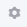
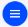

.. |widget-header-kebab| image:: images/widget-header-kebab.png
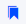
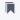

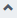
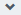

The ‘cog wheel’ button |cog-widget| (in the upper right corner of a widget) will open a pop-up window that allows you to change the options for the widget. 

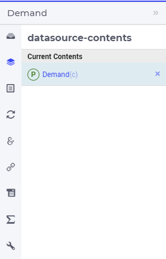

This Option Editor consists of several tabs. It depends on the widget type which tabs are available. Tabs that are available for most of the widgets are:

.. contents:: Widget Options List
    :local:
    :depth: 1
       
       
.. important::
	From AIMMS 4.66 onwards, the Filter tab is not present anymore in any widget. In existing projects where this functionality is still used, it is still working/supported by the WebUI. However, the preferred way of filtering is by using the newer slicing functionality on any identifier(s) displayed in your widgets. If you want to switch to using the slicing functionality instead of the old filters, you can do so by removing the old filters by either emptying the content in the 'Contents.filters.in' property on the 'Advanced' tab, or by opening the model in a previous AIMMS version to remove the filtering. After that, you should add the correct slicing to your identifier(s). From AIMMS 4.90 onwards, you will get a deprecation warning when opening any model containing widgets using this functionality.

.. note::
    Option changes are automatically saved to the WebUI Server.
	

Contents
--------

At the Contents tab of the Widget Options, you can specify for which AIMMS identifier(s) the widget should show the data. 

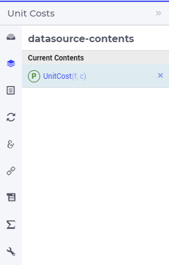

You can change the *Current Contents* by searching for a specific identifier at *Available Data*. By clicking on the identifier, it is added to the *Current Contents* list. In case only one identifier is allowed for a specific widget, adding another identifier will delete the previous identifier from *Current Contents*. If multiple identifiers are allowed in a widget type, adding an identifier will extend *Current Contents*. 

You can delete an identifier from *Current Contents* by clicking on the cross on the right of it. You can re-order the identifiers at *Current Contents* by drag-and-drop, or by clicking on the triangles in front of the identifier.

.. tip::

    In case you cannot find the identifier which you are looking for in *Available Data*, you might need to check whether the identifier is present in the (authorization) set `AllPublicIdentifiers <creating.html#public-identifiers>`_.

Additional Identifier Properties
++++++++++++++++++++++++++++++++

For every identifier which you have specified as part of the Contents_ option in your widget you can also specify some additional identifiers in AIMMS in order to indicate certain properties for that identifier. More specifically, for a given identifier :token:`X` you can specify (create in AIMMS) the following:

* :token:`X_annotations` to hold WebUI annotations that are put as CSS classes on associated DOM elements in your model. Please see the `Data-Dependent Styling <webui-folder.html#data-dependent-styling>`_ section for more details.
* :token:`X_flags` to make updatable identifiers appear as read-only in the WebUI. Please see the `Data-Dependent Styling <webui-folder.html#data-dependent-styling>`_ section for more details.
* :token:`X_text` to hold additional text to be shown within the DOM element associated with a data tuple. This option is currently only supported by the Gantt chart widget in the AIMMS WebUI. The CSS classes defined via the annotations identifier of the identifier :token:`X` itself will also be set for text displayed in the associated DOM element. You can use this, for instance, to change the styling of the displayed text of elements you want your end-users to pay extra attention to. 
    
    * For the Gantt chart, you can set CSS for the task text via ``.tag-ganttchart .label``, possible compounded with the additional CSS classes set via the annotations identifier of the <duration> parameter.
 
* :token:`X_tooltips` to hold a string representing some (additional) info which may be displayed in a tooltip associated with the identifier :token:`X` used by a widget
* A procedure named :token:`UponChange_X`, which will automatically be run whenever the value of identifier :token:`X` is changed from within the WebUI. AIMMS accepts two forms of an UponChange procedure:

   #. a procedure without arguments. You can use this form if you are not interested in the which particular values changed, but do want to get a notification that a change took place
   #. a procedure with two input arguments, both with the same domain as the identifier :token:`X`. The first argument should be a numeric parameter, and will hold a 1 for each tuple that was changed. The second argument should have the same type as the :token:`X` and will hold the old value for such a tuple, the changed value can be obtained via :token:`X`. 

   .. code-block:: aimms

      Parameter X {
         IndexDomain: a;
      }

      Procedure UponChange_X {
         Arguments: (hasChanged,OldValue);
         Parameter hasChanged {
            IndexDomain: a;
            Property: Input;
         }
         Parameter OldValue {
            IndexDomain: a;
            Property: Input;
         }
      }

   In the above example, ``X`` and ``OldValue`` should have the same type.
    
  The latter form can be used, for instance, to detect which tasks in a Gantt chart has moved, or to act upon a block edit in a table.

Identifier Annotations
++++++++++++++++++++++

The kind of additional identifier properties discussed above may be specified more elegantly by using the so-called *annotations* in the AIMMS model. 

.. important::
	This feature is available for '_annotations' kind of properties starting from AIMMS 4.49 on and for '_flags', '_text", and '_tooltips' kind of properties starting from AIMMS 4.71 on.
	
	It is referred to as the "new style annotations" (versus the "old style annotations" as discussed in the previous section). These new style annotations are the recommended ones from the moment they became available in AIMMS.

To start with, in the attribute form of the identifier for which you want to specify annotations, you can add the :token:`webui::AnnotationsIdentifier` annotation attribute and then fill in the string parameter containing the desired annotations there:

.. image:: images/Annotations_view1.png
    :align: center

The specified string parameter should have as value a space-separated string of class-names (that will be used to decorate the so-called DOM elements with in the front-end). Such a string may be then used in combination with an additional project-specific `CSS <webui-folder.html#css-styling>`_ file in order to define or refine the styling of some parts of the WebUI which reference the original identifier. Please see the `Data-Dependent Styling <webui-folder.html#data-dependent-styling>`_ section for more details.

The string parameter used in the annotation attribute may have any name of your choice, so it is no longer intrinsically linked to the name of the original identifier. Therefore,  when the original identifier is renamed, one no longer needs to rename the annotation parameter accordingly.

If an identifier X does not have the :token:`webui::AnnotationsIdentifier` annotation attribute added or this attribute exists but it is empty, then AIMMS will fall back on the values of :token:`X_annotations` discussed above, if this is present in the model.

Similarly, in the attribute form of the identifier for which you want to specify flags, you can add the :token:`webui::FlagsIdentifier` annotation attribute and then fill in the string parameter containing the desired flags there:

.. image:: images/Annotations_view2.png
    :align: center

Again, such a string may be then used for front-end styling purposes, please see the `Data-Dependent Styling <webui-folder.html#data-dependent-styling>`_ section for more details. Also, the string parameter used in the flags annotation attribute may have any name of your choice, so it is no longer intrinsically linked to the name of the original identifier.

If an identifier X does not have the :token:`webui::FlagsIdentifier` annotation attribute added or this attribute exists but it is empty, then AIMMS will fall back on the values of :token:`X_flags` discussed previously, if this is present in the model.

Next, in the attribute form of the identifier for which you want to specify some item text, you can add the :token:`webui::ItemTextIdentifier` annotation attribute and then fill in the string parameter containing the desired item text there:

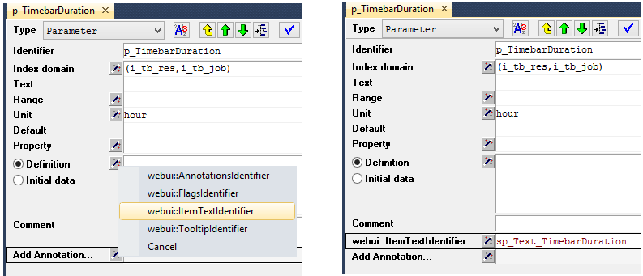

Again, the string parameter used in the item text annotation attribute may have any name of your choice, so it is no longer intrinsically linked to the name of the original identifier. The specified string for the item text is currently only used by the Gantt chart widget in the AIMMS WebUI. For example, in case the item text string has a value like "Selected Time Interval" for some block in a timeline Gantt chart, this text will appear on the corresponding block in the Gantt chart widget:

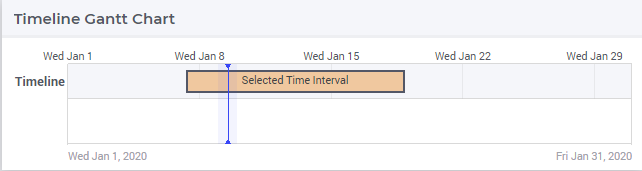

If an identifier X does not have the :token:`webui::ItemTextIdentifier` annotation attribute added or this attribute exists but it is empty, then AIMMS will fall back on the values of :token:`X_text` discussed above, if this is present in the model.

Next, we come to the identifier annotations related to tooltips. Almost all widgets offered by the AIMMS WebUI support tooltips. These tooltips have some default value. For example, when hovering over a Table cell, its value is displayed.  However, they can also be completely user-defined, giving the user freedom in determining the contents to be shown. 
In order to create user-defined tooltips, in the attribute form of the identifier for which you want to specify tooltips, you can add the :token:`webui::TooltipIdentifier` annotation attribute and then fill in the auxiliary string parameter containing the desired tooltips there:

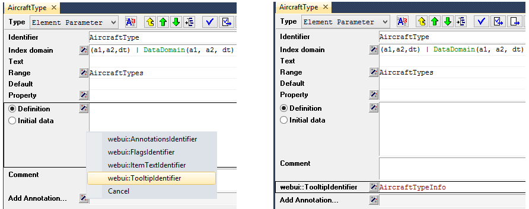

Such an auxiliary string parameter may have any name of choice, but must have the same index domain as the corresponding model identifier. 

For example, consider the following table, which shows aircraft types for specific flights through the identifier :token:`AircraftType` for which you want to override the default tooltips:

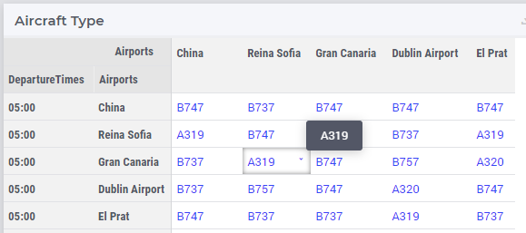

As one can see, hovering over the cell with value 'A319' just shows this value in the default tooltip. In order to change this, in addition to the displayed :token:`AircraftType(a1,a2,dt)`, the auxiliary :token:`AircraftTypeInfo(a1,a2,dt)` string parameter is added to the model and filled into the :token:`webui::TooltipIdentifier` annotation attribute of the original :token:`AircraftType` identifier. 
When using the following definition for :token:`AircraftTypeInfo(a1,a2,dt)`:

.. code::

    FormatString("Flight from %e to %e is operated by the %e aircraft type", a1, a2, AirCraftType(a1, a2, dt))

the result when hovering over the same cell as above looks like this:

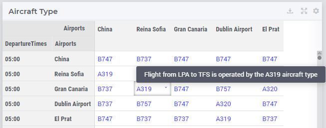

If an identifier X does not have the :token:`webui::TooltipIdentifier` annotation attribute added or this attribute exists but it is empty, then AIMMS will fall back on the values of :token:`X_tooltips` discussed above, if this is present in the model.

A special case of the tooltip annotation is the :token:`webui::IdentifierTooltip` annotation. It is not included in the 'regular' annotation (i.e. the list you see under the 'Add Annotation...' attribute of identifiers in the AIMMS model tree). Instead, it is an identifier which is indexed over the pre-declared set :token:`AllIdentifiers`. With it, you can specify the tooltip which will be displayed when hovering any identifier name which is displayed in the WebUI. As of AIMMS 4.89, this is supported for the Table widget, but we aim to support it across the WebUI. An example of its use is:

.. code::

    webui::IdentifierTooltip('place_from') := "The place in the world from which the transport takes place.";

In the header section of a Table widget displaying the :token:`place_from` identifier (the name of which might not be immediately clear to users), you can now hover this identifier name and you will see the string above in a tooltip.

We advise you to set up this identifier in your initialization routines, such as MainInitialization. 

Last (but not least), we discuss the identifier annotations related to the procedures "upon change". In order to specify a procedures "upon change", in the attribute form of the identifier for which you want to specify such a procedure, you can add the :token:`webui::UponChangeProcedure` annotation attribute and then fill in the name of the desired procedure there:

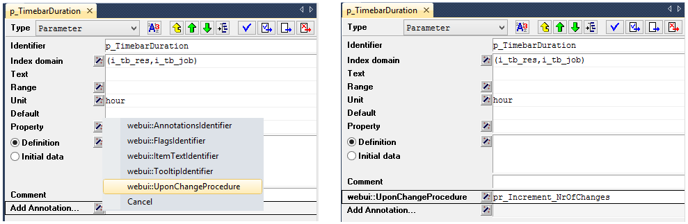

Such a procedures "upon change" may have any name of choice, so not necessarily related to the name of the underlying identifier itself. 

If an identifier X does not have the :token:`webui::UponChangeProcedure` annotation attribute added or this attribute exists but it is empty, then AIMMS will fall back on the :token:`UponChange_X` procedure discussed above, if this is present in the model.

.. note::
	Upon starting up a project AIMMS checks whether there are old style annotations in your model and if so, AIMMS points them up and recommends updating to new style annotations. 
	 
	This is controlled through the project option *Check_for_old_style_WebUI_annotations*, which has default value 'Yes'. When this option is set to 'No', the checking step is skipped upon project startup.
	
.. warning::
   **Security Warning:** 
   Putting JavaScript code in an identifier (like the string filled in the :token:`webui::TooltipIdentifier` annotation attribute or like :token:`X_Tooltips`) with write-permission from multiple users (like in :doc:`/cdm/index`)
   would allow a malicious user to do `Persistent XSS <https://en.wikipedia.org/wiki/Cross-site_scripting#Persistent_(or_stored)>`_.
   For example a malicious user could record all actions done by another user.	
	
HTML Tooltips
+++++++++++++

Besides the simple text-based tooltips illustrated above, one may also use HTML-based tooltips, which allow to display more sophisticated contents when hovering over the data entries in a widget.
In this case the data of the string parameter filled in the :token:`webui::TooltipIdentifier` annotation attribute (or the data of the old style :token:`X_Tooltips` associated with an identifier :token:`X`) must be in HTML format. For more info on HTML in general, please see for example websites like `html.com <https://html.com/>`_ or `www.w3schools.com <https://www.w3schools.com/html/>`_ .

Next we illustrate this feature based on some concrete examples for various widgets.

Suppose the data of a 2-dimensional parameter DailyNumberOfPassengers(i1,i2) is shown in a table widget, where i1 and i2 are alias indexes in a set Islands. 
One can declare the string parameter DailyNumberOfPassengersInfo(i1,i2) to be filled in the :token:`webui::TooltipIdentifier` annotation attribute and defined its HTML data value in the AIMMS model as follows:

.. code::

	FormatString(
	"
  <i>From:</i> %e   <i>To:</i> %e   <i>Pax:</i> %n", 
	i1, 
	i2, 
	DailyNumberOfPassengers(i1,i2)
	);

.. The following is part is commented out
   .. image:: images/Def_Tooltip_DailyNumberOfPassengers.png
      :align: center

In this case the tooltip for a cell in the table looks like in the following picture:

.. image:: images/Tooltip_Table_1.png
    :align: center

.. note::
   **Using HTML format:** 
   Where in a simple text-based tooltip you used \\n to move to a new line, in a HTML-based tooltip this needs to be replaced by `` ``, see example above.
   Similarly, the usage of \\t in text-based tooltips should be replaced by HTML tables, see further below.

Next, suppose that the data of a 1-dimensional parameter TotalCostPerIsland(i) is rendered in a barchart widget. A HTML-based tooltip may be added to the :token:`webui::TooltipIdentifier` annotation attribute of this parameter by using an auxiliary string parameter, say TotalCostPerIslandInfo(i), defined in the AIMMS model as

.. code::

	FormatString(
	" Total cost %e: %n  ", 
	i, 
	TotalCostPerIsland(i), 
	IslandImageURLs(i)
	);

.. The following is part is commented out
   .. image:: images/Def_Tooltip_TotalCostPerIsland.png
       :align: center

where for each element i of the set Islands, IslandImageURLs(i) is a string parameter holding the web URL of a corresponding (island) image. 
In this case the tooltip for a bar in the chart looks like in the following picture:

.. image:: images/Tooltip_Barchart_1.png
    :align: center

Of course, one can easily change type of the widget to linechart, piechart, or treemap, and the same tooltip contents may be used for these widgets as well:

.. image:: images/Tooltip_LinePieTree_1.png
    :align: center

In case the costs of all islands were aggregated in a scalar parameter TotalCostALLIslands which is then shown in a scalar widget, a similar HTML-based tooltip contents may be added 
using a TotalCostALLIslandsInfo string parameter in the :token:`webui::TooltipIdentifier` annotation attribute of TotalCostALLIslands. This string parameter may be defined in the AIMMS model for instance as follows:

.. code::

	FormatString(
	" Total costs all islands: %n  ",  
	TotalCostALLIslands,
	ALLIslandsImageURL
	);

.. The following is part is commented out
   .. image:: images/Tooltip_Scalar_Def_1.png
       :align: center

where ALLIslandImageURL is a string parameter holding the web URL of a corresponding (all islands) image. In this case the tooltip in the WebUI looks like in the following picture:

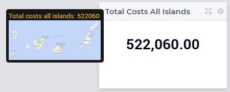
	
.. note::
   **Using Application-Specific Resources:** 
   By using a string of the form *"/app-resources/resources/images/Canarias.png"*, one may refer to an image included in the *resources/images* subfolder of the `WebUI folder <webui-folder.html>`_ of the application directory.
   
Now, suppose that some aircraft data is shown in a bubblechart, where the size of the bubbles is determined by a parameter NumberOfSeats(p) with p being the index of a set Planes.
Again, one may add and fill in a string parameter NumberOfSeatsInfo(p) to the :token:`webui::TooltipIdentifier` annotation attribute of NumberOfSeats. This string parameter may be defined for example by using the HTML data value as shown here:  

.. code::

	FormatString(
	"%e: %n seats  ", 
	p, 
	NumberOfSeats(p), 
	PlaneImageURL(p)
	);

.. The following is part is commented out
   .. image:: images/Tooltip_Bubblechart_contentsDef.png
       :align: center

where for each element p of the set Planes, PlaneImageURL(p) is a string parameter holding the web URL of a corresponding (plane) image. Then the resulting tooltip in the bubblechart widget looks as follows:

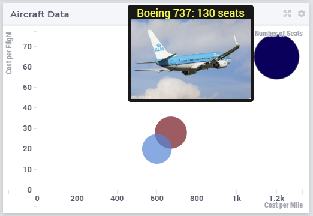

Finally, suppose that in a Gantt chart widget we show some schedule data for several activities performed by a few people, with the duration given by the data of a parameter ``JobDuration(pe,j)``,
where ``pe`` is the index of the set Persons and j is the index of the set Jobs. When using the default tooltip, the info for a block in the chart is rendered as:

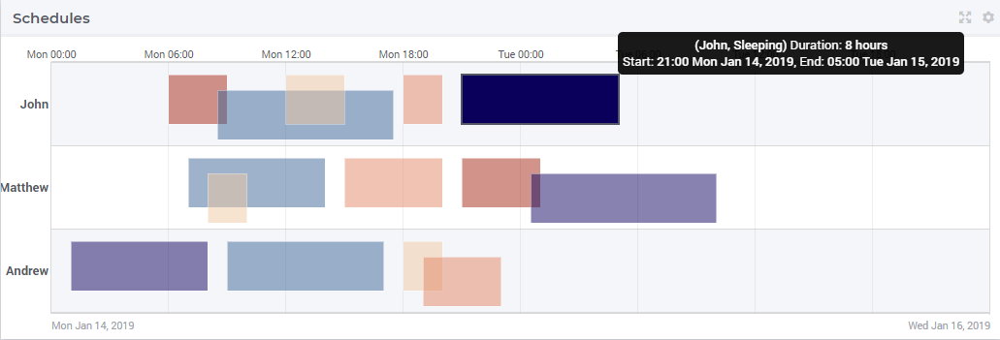

However, one may customize the info by adding a string parameter JobDuration_Tooltips(pe,j) to the :token:`webui::TooltipIdentifier` annotation attribute of JobDuration, holding HTML data for example as shown here:

.. code::

	"
"  +
	"<Table>" +
		"<TR>"  +
			"<TD>"  +
					"<B> Person : </B>" +
			"</TD>" +
			"<TD>"  +
					pe +
			"</TD>" +
		"</TR>" +
		"<TR>"  +
			"<TD>"  +
					"<B> Activity : </B>" +
			"</TD>" +
			"<TD>"  +
					j +
			"</TD>" +
		"</TR>" +
		"<TR>"  +
			"<TD>"  +
					"<B> Duration : </B>" +
			"</TD>" +
			"<TD>"  +
					JobDuration(pe,j) +
			"</TD>" +
		"</TR>" +		
	"</Table>"

.. The following is part is commented out
   .. image:: images/Tooltip_Ganttchart_contentsDef.png
       :align: center

In this case, the customized tooltip based on the HTML table layout (see also the Note above regarding HTML format) looks like in the following picture:

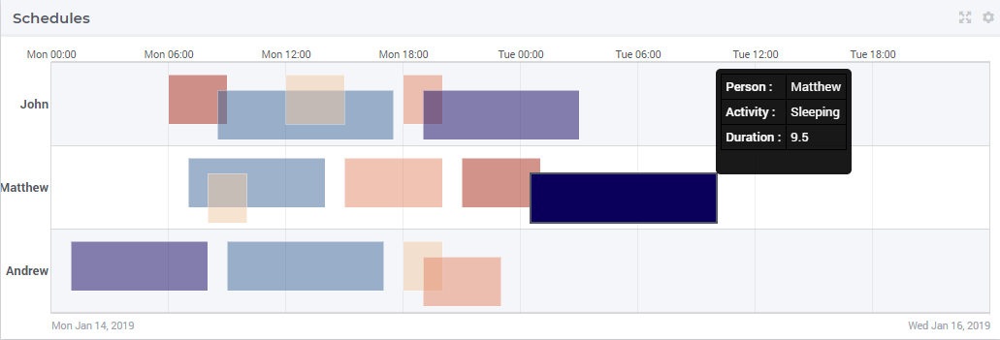

You can display icons from our `icon list <../_static/aimms-icons/icons-reference.html>`_, in the HTML tooltips. You will need to include a class property with the value of the icon name as illustrated below:

.. code::

    data { 
    Product-1  : "
 &nbsp\; Electronic Products 
",
    Product-2  : "
 &nbsp\; Household Products 
",
    Product-3  : "
 &nbsp\; Kitchen Equipment
",
    Product-4  : "
 &nbsp\; Gardening Products
",
    Product-5  : "
 &nbsp\; Heavy Equipment
",
    Product-6  : "
 &nbsp\; Industrial Products
",
    Product-7  : "
 &nbsp\; Stationery Products
",
    Product-8  : "
 &nbsp\; Kids Products
",
    Product-9  : "
 &nbsp\; Misc
",
    Product-10 : "
 &nbsp\; Non Categorized
" }

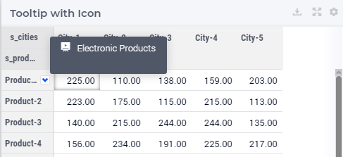

.. note ::

    Ensure you escape the quotes in the HTML properties. e.g., ``\"``.

**From AIMMS version 4.79** it is possible to configure custom tooltips for the elements in the row and column headers of the `Table <table-widget.html>`_ and on the x-axis elements of the `Bar Chart <bar-chart-widget.html>`_, `Line Chart <line-chart-widget.html>`_ and `Bar-Line Chart <bar-line-chart-widget.html>`_.

You need to add the ``webui::TooltipIdentifier`` annotation attribute to the set and specify the string parameter indexed over the respective set. For example: 

.. code ::

    Set Netherlands {
        SubsetOf: AllLocations;
        Index: net;
        Definition: data { Amsterdam, 'Den Hague', Eindhoven, Haarlem };
        webui::TooltipIdentifier: NetHeaderTooltips;
    }

    StringParameter NetHeaderTooltips {
        IndexDomain: net;
        Definition: {
            formatstring("Current Capacity    <b>%e</b>    %n",net,CurrentCapacity(net));
        }
    }

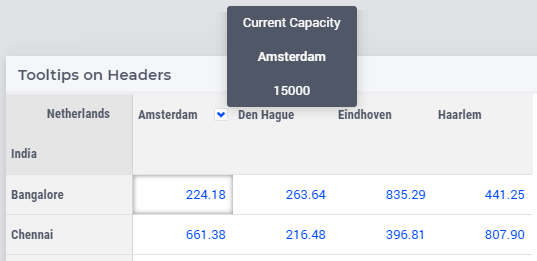

The same tooltip will show for the x-axis elements on the Bar, Line and Bar-Line charts, as illustrated below:

.. image:: images/Tooltip_ChartElements.png
    :align: center

If you do not want to show the default tooltips for certain identifiers or data items, you can make this possible by clearing or emptying the data for the respective identifier or data point in the string parameter defining the tooltips.  

For example, consider the table below. Say, you do not want to show the tooltip with the same value as the cell value, or if the value of a cell is 0.

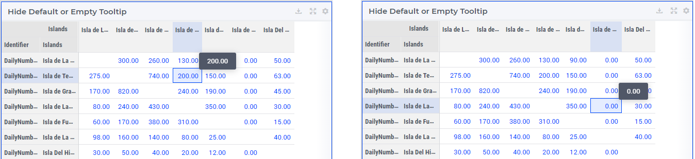

Then in the string parameter defining the tooltips, you can just clear/empty the data for these specific cases that you desire to hide the tooltip for.

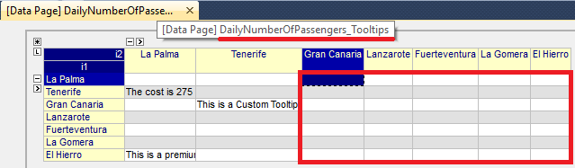

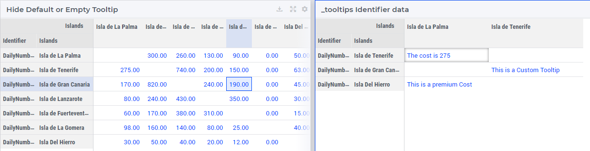

.. image:: images/Tooltip_customvalue_table.png
    :align: center

.. note::
    This feature for hiding tooltips is available from AIMMS version 4.65 and onwards. 

Identifier Settings
-------------------

The various widget types in the WebUI offer the possibility to specify settings for identifiers that are specific for the widget at hand. Currently, in the Identifier Settings options editor, you can specify the `Display Domain <#display-domain>`_ and `Slicing <#slicing>`_ for each identifier that is specified in the `Contents <#contents>`_ section of the widget:

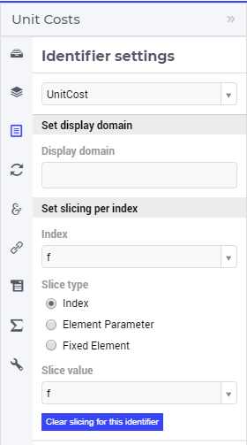

Display Domain
++++++++++++++

Sparse vs. Dense
^^^^^^^^^^^^^^^^

In both AIMMS and the WebUI, the data is displayed in a sparse manner by default. In the WebUI, this means that, for example, a Table widget showing an identifier that has a complete row or a complete column with only default (0) values, does not display such a row or column at all. When merely displaying your data, this is usually convenient, but if you want to edit your data, it becomes hard if the row/column that contains the default (0) value that you want to edit is not displayed at all. For such situations, it makes sense to display the data in a dense way.

Specifying Display Domain
^^^^^^^^^^^^^^^^^^^^^^^^^

In order to provide you with control over the sparsity pattern of your widget data, you can specify a so-called *display domain* for each identifier that is present in your widget:

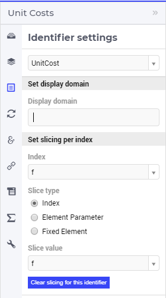

The domain that you enter in the options editor above, can be an identifier, or, in its simplest form, just a 0/1 value:

* Specifying no value at all (the default situation) means that  the identifier displays in a sparse way, i.e. only the rows/columns containing non-default values are displayed. (except for the scalar widget, please see warning below)
* Specifying a value of 0 means that the identifier displays nothing at all.
* Specifying a value of 1 means that the whole identifier will always be displayed, even if it only contains default values.

You can obtain a more fine-grained level of control by specifying an *identifier* which contains a sparsity pattern.

.. warning::
    
    The default behavior of the scalar widget (when specifying no value ``Display domain : <empty>`` ) is ``Display domain : 1``, whereas it is ``Display domain : 0`` in every other widget. This enables you to see by default every identifier added in the scalar widget. 

Examples
^^^^^^^^

To illustrate the above, here are some examples that show the difference between all usages of the display domain, applied to the same table. This table contains two columns and a number of rows containing checkboxes.

First, here's the table, with the display domain not specified at all (i.e. the default behavior) *and* the table containing only 0 values:

.. image:: images/tableonlyzeroesnodd.jpg
    :align: center

As expected, no rows are displayed at all here, which makes it impossible to change any value. To overcome this, we can set the display domain of the first identifier to 1, which leads to the following table:

.. image:: images/tableonlyzeroesdd1.jpg
    :align: center

As you see, editing the values is possible now. Checking a number of checkboxes could for example lead to the following table (with the display still set to 1):

.. image:: images/tablesomevaluesdd1.jpg
    :align: center

Now let's remove the '1' again for the display domain of both identifiers and set it to its default value (i.e. not filled in):

.. image:: images/tablesomevaluesdd0.jpg
    :align: center

As you can see, now only the rows (and columns) which contain non-zero values are displayed. To illustrate the effect of specifying an identifier for the display domain, the following table shows what happens to the table if we create a binary identifier :token:`MoleculeDisplayDomain(m)`, with the following definition:

.. code::

    if StringOccurrences(m, "O") then 1 else 0 endif;

In English, this means: for all rows for which the molecule :token:`m` contains the symbol :token:`O` (oxygen), the display domain should be set to 1. If we fill in this identifier for the display domain option, the table changes as follows:

.. image:: images/tablesomevaluesddidentifier.jpg
    :align: center

As expected, this table only shows the rows for which the molecules contain an O in their name, regardless of the value of their associated checkboxes (note the non-displayed row for the C7H16 molecule!). Specifying an identifier for the display domain is the most flexible way of determining the display domain. You can also use it to only display a slice of a displayed identifier, by only setting the associated display domain identifier to 1 for a specific value of one of its indexes.

.. warning ::
    
    Please be aware that you should define the display domain rigorously over **the same set** (or subset) as the domain of the shown identifier.

Slicing
+++++++

Identifiers in AIMMS can have multiple dimensions. You can specify these dimensions in AIMMS via the index domain of an identifier. 
These identifiers can be displayed in the WebUI and their data is shown over all these dimensions  by default. 
However, there are also cases where you only want to see part of the dimensions/data. 
In situations like this, you can slice the indices of one or more identifiers in your widget. This can be done by the 'Set slicing per index' option at the 
`Identifier Settings <#identifier-settings>`_ tab of the `Widget Options <widget-options.html>`__.

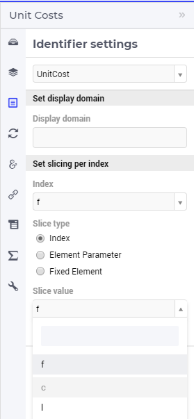

Set slicing per index
^^^^^^^^^^^^^^^^^^^^^

For each identifier in the widget, you can specify a separate slicing. To do so:

#. On top of the Identifier Settings tab, select the identifier that you want to slice. 
#. At 'Set slicing per index' you select the index that you want to slice (every index can have its own slicing). 
#. Specify the 'Slice type' that you want to apply for this index. 
#. Specify the corresponding 'Slice value'. 

Slice type and Slice value
^^^^^^^^^^^^^^^^^^^^^^^^^^

You can select from three different types of slicing, with corresponding slice values:

* **Index** - You can slice the selected index to another (related) *index*. At 'Slice value' you can then select from all indices that have the same rootset. Slicing to a different index is useful when you e.g. only want to see a subset of the elements of the original identifier, in which case you would slice to an index of a subset of the original index.
* **Element Parameter** - You can slice the selected index to a (related) *element parameter*, which you can specify as the 'Slice value'. The selected index is then fixed to the current value of the selected element parameter. The widget will show the data of the identifier, only for the element in the element parameter for the selected index.
* **Fixed Element** - You can slice the selected index to a *fixed element*, which you can specify as the 'Slice value'. The selected index is then fixed to the selected literal element value. The identifier data will only be displayed for the selected element for the selected index.

Index
^^^^^^

When selecting an index in the index selectionbox, you can also see an overview of how all the indices in your widget are sliced. E.g. in this picture, you can see that there are 2 indices, both sliced. The first index, f, is sliced to the Element Parameter (EP) 'SelectedFactory'. The second index, c, is fixed to element 'Amsterdam':

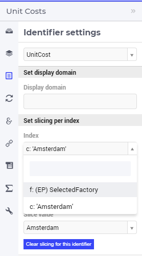

Clear slicing
^^^^^^^^^^^^^

To easily clear the slicing of an identifier for all its indices, you can press the 'Clear slicing for this identifier' button. Of course you need to make sure that you have selected the identifier for which you want to clear the slicing in this widget.

.. important::

    Some of the widgets require multiple identifiers as input (contents). When you slice one or more of these identifiers, you need to make sure that the resulting index domains match.

.. tip:: 

    Whenever you slice one dimension (index) of an n-dimensional identifier to a *fixed element* or *element parameter*, its dimension will become n-1. This is good to realize, as some widgets require identifiers of a certain dimension. E.g: In the map widget, the arcs identifier needs to be two-dimensional over the set *nodes x nodes*. Whenever you slice one dimension to a fixed element (or element parameter), you effectively loose a dimension and it becomes impossible for the map widget to map data to arcs. As a work around you can consider to create a set containing a single element and use subset slicing here: whenever you do subset slicing, the dimension of the data that is displayed, is not reduced. 
	

Please mind when slicing over a subset in a table, other identifiers defined over the corresponding superset are considered as defined over a different set. Thus you might end up with the following unexpected behavior: 
	
.. image:: images/subset-slicing-1.png
    :align: center
	
Where slicing all your identifiers (not just one) over the same subset will fix the display:
	
.. image:: images/subset-slicing-2.png
    :align: center

Examples
^^^^^^^^

The transport table is not sliced. All non-default data is displayed.

.. image:: images/slicingexample-noslicing.png
    :align: center

The transport table is sliced to show the transport from a single selected factory (via element parameter) to all locations.
    
.. image:: images/slicingexample-elementparameter.png
    :align: center

The transport table is sliced to show the transport from all distribution locations (subset with index ``distr``) to the fixed location (fixed element) 'Breda'.
    
.. image:: images/slicingexample-subset-fixedelement_v1.png
    :align: center

	
Expanding indexes
+++++++++++++++++
.. note::
    The feature described in this section (and in the Example underneath) is available only in AIMMS releases from 4.62 onwards. 

In some situations, some identifiers may be declared in the model over some super-sets and other identifiers may be declared over some sub-sets of those super-sets. However, it may be beneficial to show all the data
of several such categories of identifiers in the same widget, for example in a table widget. If all indexes involved are used as separate indexes in a widget, then they are treated as "independent" 
in the Pivoting section and the resulting layout of the data in the widget may not be an "intuitive" one. 

For example, in the Transnet application (see the "Quick Start: My First WebUI" section) the parameters Latitude(l) and Supply(f) are declared over the super-index l of the set Locations 
and over the index f of the sub-set Factories, respectively. If the data of both parameters is shown in a table widget with their indexes as declared originally in the model, then the table 
layout may look like in the following picture on the right:
    
.. image:: images/CubeDomain_Table2_View1.png
    :align: center

However, such a layout may not look "intuitive", because the set of Factories may be regarded more naturally as "contained" in the set Locations, instead of as an "independent" set.

In such situations, it is possible to expand an index to a super-index, that is, to an index in a super-set of the initial index set. Such expanding may be achieved through the same options 
in the widget editor which are used for slicing, as explained above. However, in this case an identifier may be rendered over a larger domain than its declared domain and some "values" 
may be just empty, i.e. flagged as "outside-domain". When an index has been expanded to a super-index, it will no longer be treated as a separate index in the Pivoting section, but rather 
as "contained" by its super-index. Please note that, like slicing, the index expanding is also applied per each identifier specified in the widget Contents.

For example, in the Transnet application, the index f of parameter Supply may be expanded to the super-index l corresponding to the super-set Locations. In this case, the index f no longer appears
in the Pivoting section and the resulting layout of the data in the widget looks more intuitive as illustrated below:
 
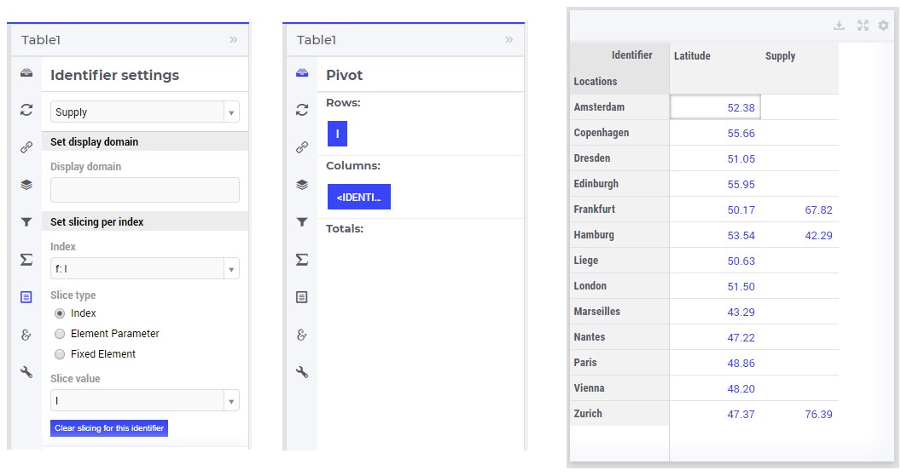

Note that, in this case the cells of the column Supply which are outside domain are simply empty and not editable. 

Example
^^^^^^^

The index expanding may be involved in more complex data layouts as illustrated by the example in this section. 

Assume that our TransNet application has been extended with a super-set AllNetworkNodes (with alias indexes n, n_from, n_to) of the set Locations, which also has another sub-set PotentialSites (with index s)
with elements { Munich, Nuremberg }. Moreover, assume that the parameters Latitude and Longitude are now declared over the root index n and that the parameters LocationSize(l) and PotentialSize(s) 
have been declared additionally in the model. Then one can show the data of Latitude(n), LocationSize(l), PotentialSize(s), Supply(f), Demand(c), and UnitCost(f,c), all in the same table widget, 
by expanding each sub-index l, s, f, or c to one of the super-indexes n or n_to in the super-set AllNetworkNodes as illustrated below:
 
.. image:: images/CubeDomain_Table3_Settings.png
    :align: center

In this case, the layout of the data in the table widget looks like in the following picture:
 
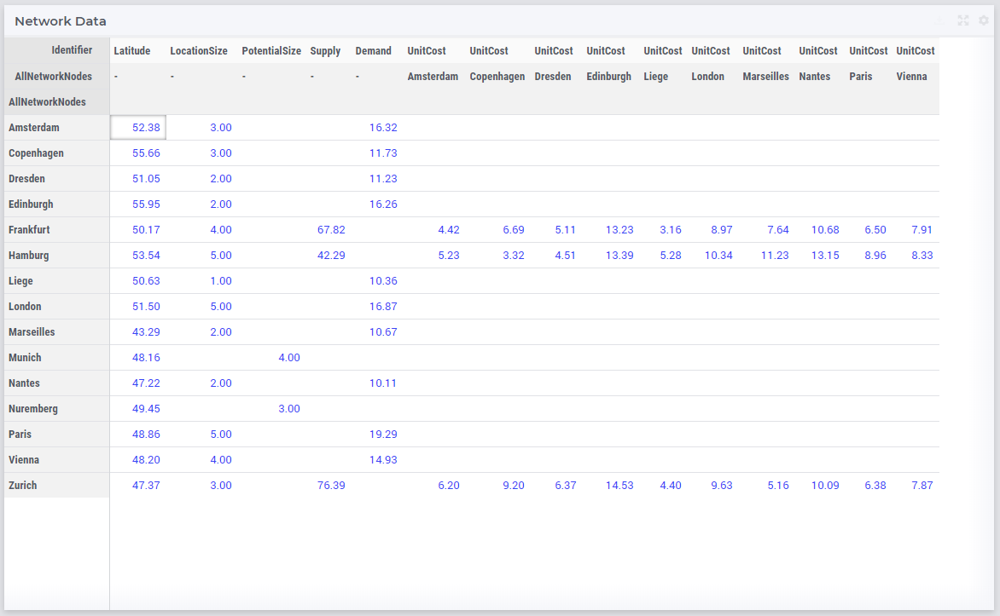

So, in this table all the data of the above mentioned identifiers is shown together, while the Pivoting section of the table only consider 2 indexes instead of the 5 original indexes used in the
model declarations. All the cells which show no value are simply empty ("outside-domain") and not editable in the table.

Widget Named Views
------------------
    
.. important::   
    From **AIMMS 4.95 onwards**, the **Widget Named Views** feature is made available as an `experimental feature <#experimental-features>`__ under the same name. This is a Beta release,  meaning the feature is available to be used and tested. We collect feedback and suggestions for further improvement that may or may not be implemented before this will become a General Availability feature.
    
     
With this feature you can create and offer different views of your widget. For example, you could offer one view of your widget with one particular pivoting and another view of the widget with a different pivoting. The widget could be made available in yet another view as a different widget type. The app developer can specify the view that an end user sees on the widget when they first load the page.
    
The widget header section now includes a new button |WNV-select-views|. Clicking on it allows end users to see the available views for this widget, from which they can choose and load a view. 
     
In the `widget options <#widget-options>`__, under the **Widget Named Views** |WNV-option-editor-tab| tab, there are controls to add, edit and delete a named view as well as to designate a named view as the *Current View* that users see when their WebUI page loads. The option to create a new named view is available when you click the "+" button. The current widget configuration is stored for the view name that you set through the *View Name* option. The *Current View* option can be tuned to one of the view names from the list of available named views. When the WebUI page loads, the widget is loaded with this designated view information. App developers can specify the named view they want their end users to see when the page loads using this current view option.    
When you hover over each named view option header, the Up |WNV-order-up| and Down |WNV-order-down| controls appear, allowing you to order the different named views that have been made.

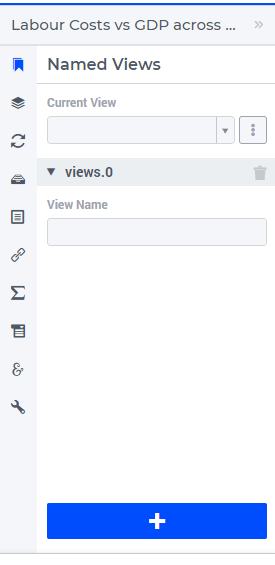
       
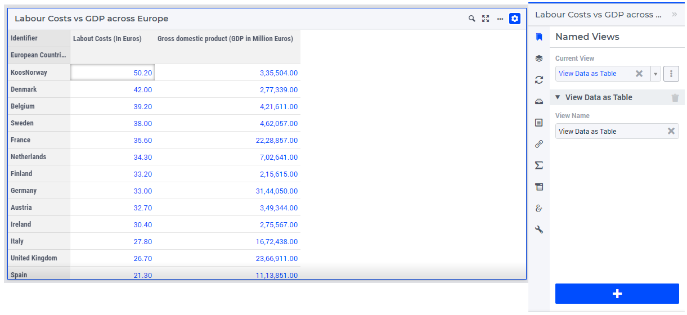
       
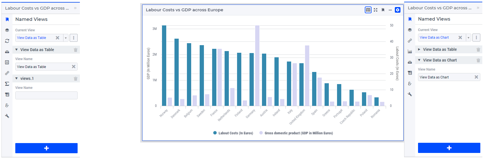
       
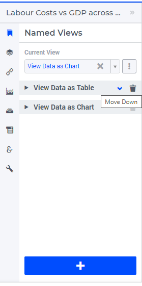

The Current View option can be specified by a literal view name, or by an element parameter. This element parameter should have a set as its range, which contains a collection of applicable named views for the widget at hand. The benefit of specifying such an element parameter is that you can dynamically switch from one view to another from within the model itself: just set the element parameter to a different view than the one currently selected, and the widget will update accordingly. Please note that the set belonging to this parameter does not necessarily have to include all available view names for the widget: just a subset of those is also allowed. In case the set contains elements which do not correspond to existing view names for the widget, those will be ignored. The Widget Named View menu in the widget header will automatically display all valid view names from the set.

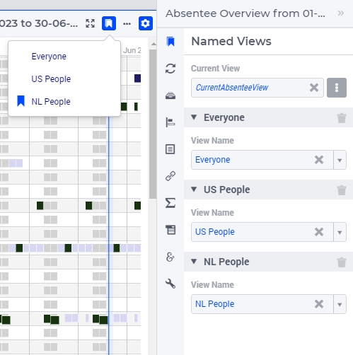

To illustrate this, in the context of the image above, the model contains a set `AbsenteeViews` with `data {'Everyone', 'US People', 'NL People'};` as its definition, an element parameter `CurrentAbsenteeView` with this set as its range which is specified for the Current View option. In the image, the value of `CurrentAbsenteeView` is `NL People`. As you can see, this is reflected in the widget header menu showing the named views and the currently selected one.

Please be aware that it is possible to have more literally specified named views than the set belonging to the Current View option element parameter. If you specify, let's say, six named views and the set contains just two of them, then if you specify the element parameter for the Current View option, the widget header menu will only show those two views.

When one or more named views are created for a widget, the |wnv-select-views| button is made available on the widget's header section. When you click on it, a list of the various named views made for this widget appears, in the order the views were arranged. The |WNV_current_view_icon| icon serves as an indication of the currently active view.
       
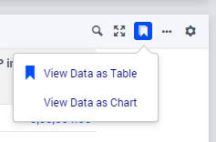

Any of the views are available for selection by the end user from the list and the corresponding widget configuration loads.

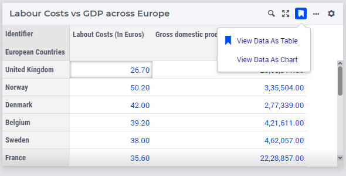
       
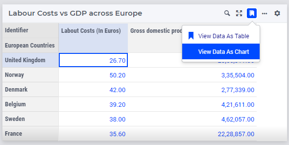
       
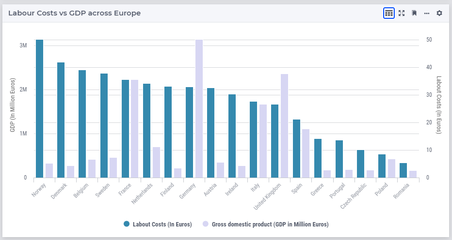

.. important::          
    If no named views have been created yet, the widget will still load as usual.

    For a named view, the current widget configuration is only saved when you provide it a name using the *View Name* option.   
    
    When all of the earlier-created named views are removed, the widget loads with the settings of the most recent view selected for the *Current View* option.

.. note::
    All widget options are recorded if you create a Widget Named View. There is one special case, though: the Visibility option. If you change its value, it will be recorded for *all* named views. The reason behind that is that if you have two Named Views and one of them has the Visibility set to 0, you can run into the situation that you have a widget on your page, change the Named View as a user and suddenly the widget disappears. After which you cannot select the original Named View (the one with Visibility 1) anymore, because the whole widget, including the Named Views menu, has disappeared.

Pivot
-----

You can pivot the indices in most of the widget types. E.g. you can change which indices should appear in the row or column of a Table widget, or which index should be stacked in a Bar Chart widget. To pivot indices, you should open the `widget options <#widget-options>`__ and go to the Pivot tab:

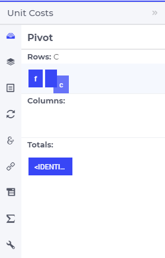

There you can drag-and-drop the indices to the different areas in your widget. E.g. in case of a Table widget, to the *Rows*, *Columns* or *Totals* area.

Store Focus
-----------

Some WebUI widgets offer you the possibility to store the (combination of) element(s) that currently have focus in the widget. E.g. in the Table widget you can store the focus cell, in the Bubble chart widget you can store the focus bubble. In WinUI you have similar functionality like this, called 'Reverse Link'. Specifying the Store Focus option opens up all kinds of interactive opportunities. E.g. by changing the focus cell in a table, other widgets could display relevant information for that specific cell.

At the *Store Focus* tab in the `widget options <#widget-options>`__ you will see a list of indices. For each index you can specify the element parameter that should be filled with the element that has the focus in the widget. 

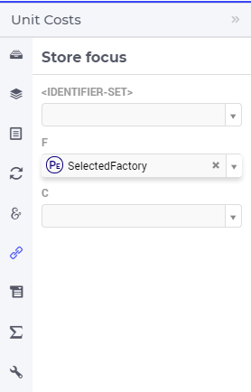
    
The list of indices also includes an index referring to IDENTIFIER-SET. You can specify an element parameter over the set AllSymbols there. This allows you to also store the identifier that currently has focus in the widget. This could be relevant when you display multiple identifiers in your widget.

.. important::
    Clicking again on the currently Selected/Highlighted chart element, gets the highlighting cleared from the respective chart element. However, the value stored in the corresponding element parameter is retained and not emptied.
    
    This also holds for the Table widget, where you cannot explicitly deselect a cell.

Totals
------

You can add totals, i.e. aggregators of (numerical) values to most widget types, such as tables or bar charts. To do so, open the `Widget Options <widget-options.html>`__ and go to the Totals tab:

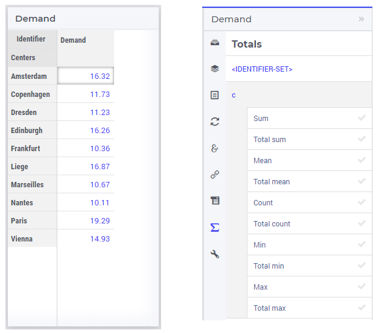

For each index in your widget, you can turn on one or several aggregators, such as summation, mean value, count of the number of entries, minimum value, maximum value. Clearly, adding such totals results in additional data being displayed in the widget view. For example, activating the "Total sum" aggregator for one index adds up all (numerical) values corresponding to that index and displays the resulting sum as an additional value in the widget view:

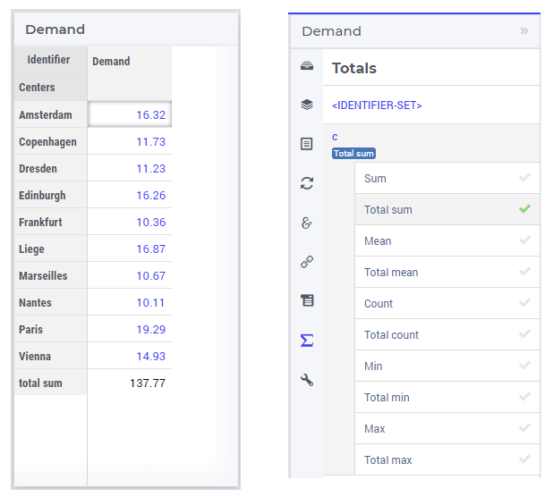

If no display domain has been specified for the shown identifier, then the "Sum" aggregator has the same effect (i.e., same value) as the "Total sum" aggregator. However, if a restricting display domain has been specified such that the widget displays less values than the full identifier domain, then the "Sum" aggregator only considers the displayed values, whereas the "Total sum" aggregator still considers all the values from the full domain. Consequently, in this case the "Sum" and the "Total sum" aggregators may result in different values being added to the widget view:

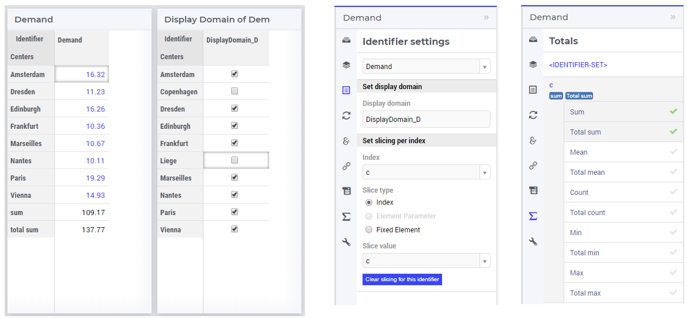

In case of an active display domain, the differences between the other aggregators, e.g. between "Mean" and "Total mean", between "Count" and "Total count", etc, are similar to the difference between "Sum" and "Total sum" illustrated above.

By default, totals are added "at the bottom" of a sequence of (numerical) values. For example, for the parameter ``UnitCost(f,c)`` we may add two aggregators such as "min" and "max" for each of the indexes of the factories f and the distribution centers c, which results in the corresponding aggregated values being displayed at the bottom:

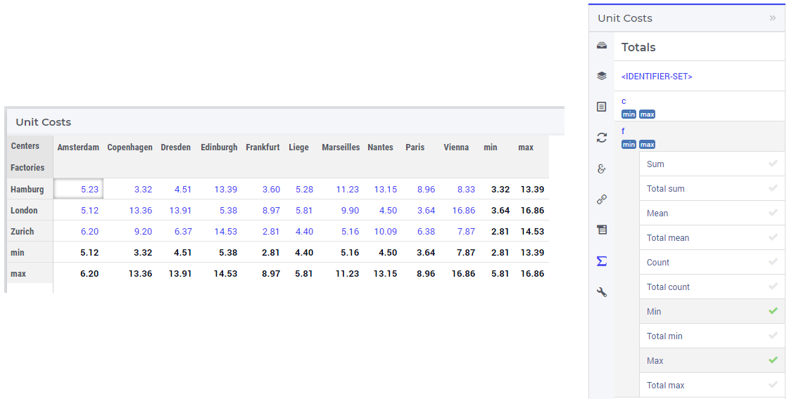

In this case the Advanced option :token:`Contents.totals` has as value the following string:

.. code::

    literal:[{"indexName":"c","operators":["min_only_visible","max_only_visible"]},{"indexName":"f","operators":["min_only_visible","max_only_visible"]}]

However, it seems more natural to move one aggregator, for instance "min", "on top" of the shown sequence of values. For now, this possibility is provided through editing the Advanced option above.
More specifically, one may append the postfix "_on_top" to any existing total specification. For example, if we edit the Advanced option :token:`Contents.totals` to read as

.. code::

    literal:[{"indexName":"c","operators":["min_only_visible_on_top","max_only_visible"]},{"indexName":"f","operators":["min_only_visible_on_top","max_only_visible"]}]
	
then the "min" aggregators are rendered on top of the corresponding sequence of values:

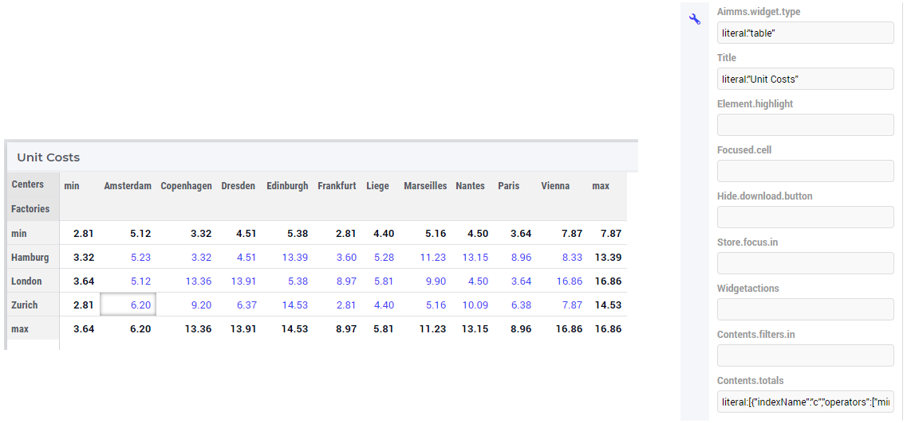

.. note::
	Please note that once having specified a "_on_top" postfix, the existing option editor should not be used anymore on aggregators, as it removes any existing "_on_top" total once you use the total options editor to make a change. So, it is advisable to add the "_on_top" postfix at the end of the process of specifying the widget options.

For the values for the "corner cells" (i.e. grand totals) AIMMS uses the natural reading order in the sense that a cell that contain aggregated values will only use information from cells to the left or on top of that cell.
This is natural in the sense that the top right cell (containing the value 7.87) contains the maximum of the cells on its left (instead of the minimum of cell underneath that cell): 

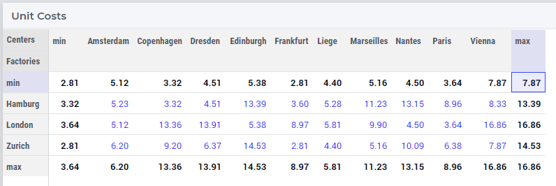

Similarly, the bottom left cell (containing the value 3.64) shows the maximum of cells on top (instead of the minimum of cell on the right):

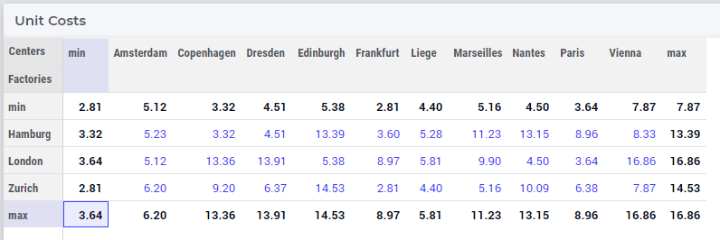

We envision that in future AIMMS versions, the possibility to add totals "on top" will be provided through dedicated, more user friendly features in the widget options editor.

Change Type
-----------

You can use all kind of widgets to display your AIMMS data. By changing the type of a widget, you can easily switch between e.g. a table or a chart, without creating a new widget for that. To do so, you should open the `widget options <#widget-options>`__ of your widget and go to the Change Type tab. There you will see the possible types to which you can switch.

Miscellaneous
-------------

Several widget options which are easier to specify are available under the *Miscellaneous* tab of the widget option editor.

Number of decimals
++++++++++++++++++

You can change the number of decimals for a widget:

* Open the `option editor <widget-options.html>`_ for the widget
* Go to the *Miscellaneous* tab, and
* Change the *Decimal Points* option.

The number of decimals displayed has a limit, the **default** is 2 decimals.

Hiding Widgets
++++++++++++++

.. |eye-blue| image:: images/eye-blue.png

There are situations where you may want to hide certain widgets for certain users. Especially if many 'roles' can be identified among the users of your applications, this may apply: for some users, data displayed in a particular widget is of no interest, while for others it is.

To help you in situations like this, every widget has an option called *Visible*, located on the *Miscellaneous* tab in its option editor. Setting this option to False (or 0) has the effect that the widget is not visible anymore. In order not to lose track of these widgets while developing your WebUI, there is an 'eye' icon |eye-blue| in the top bar, with which you can still show the hidden widgets. These are displayed in gray, in order to distinguish them easily from the visible widgets. This icon is not visible when running your WebUI app in a PRO environment (i.e. in the end-user scenario), or when you have no widgets that have the Visible option set.

It is not only possible to just specify literal values like True/1 or False/0 for the 'Visible' option: you can use any scalar AIMMS parameter that you like. This is especially powerful, since it allows you to steer the visibility of each and every widget using whichever logic you want. As an illustration, you could create an AIMMS parameter like:

.. code::

    if CurrentUserGroup = 'Finance' or CurrentUserGroup = 'Management' then 
        1 
    else 
        0 
    endif; 

to make sure that only finance people and people from the management can see one or more specific widgets.

.. important:: 

    Please note that if you want to make sure that *not* all your users can see all available data (e.g. because some of it is confidential), hiding certain widgets is not sufficient. Users can still create new widgets for showing all available data. To avoid this, you need to adapt the set `AllPublicIdentifiers <creating.html#public-identifiers>`_, such that it only contains the identifiers that the current user is allowed to see. Furthermore, you need to make sure that users cannot edit the parameter that you specified for the Visible option (e.g. by giving it a definition).

Widget Actions
--------------

.. important:: Widget Actions are available in software versions from AIMMS 4.66 onwards.

.. note:: Widget actions tutorial is available in the `WebUI Advanced User Interactions <https://academy.aimms.com/mod/page/view.php?id=971>`_ training on the AIMMS Academy

Widget Actions are a set of actions/procedures that can be defined via the model and configured for individual widgets. These widget actions are grouped under the |widget-header-kebab| icon in the widget header. The widget action displays up to 10 actions. In case you configure more than 10, only the top 10 active and/or inactive actions will be displayed.

The widget actions can be associated with any procedure in your model. For example: Resetting data, Saving data, etc.

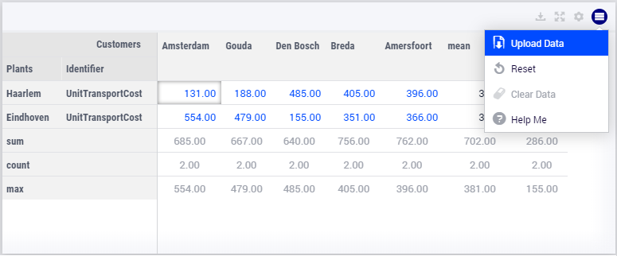

.. note::

    The Widget Actions icon in versions before AIMMS 4.75 used to be |widget-action-old| and before AIMMS 4.89 it used to be |widget-action|. The screenshots on this page have been taken with a version between AIMMS 4.75 and 4.89.

Configuring Widget Actions
++++++++++++++++++++++++++

Widget Actions can be configured by the application developer via the AIMMS model. The set :any:`webui::WidgetActionSpecification` declared inside the `Pages and Dialog Support <library.html#pages-and-dialog-support-section>`_ section is used for configuring the widget actions, as illustrated here in the next steps. 

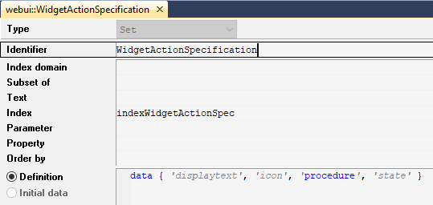

This set has 4 elements representing widget action properties: 

#. ``displaytext``: Is the text/label you would like to give the action.  
#. ``icon``: The icon you want to associate with the respective action. You can select from a list of 1600+ icons, the reference can be found in the `icon list. <../_static/aimms-icons/icons-reference.html>`_		
#. ``procedure``: The procedure you want to call when the respective action is clicked.  
#. ``state``: This is the state for the action, i.e. Active (displayed and clickable), Inactive (displayed and not clickable) and Hidden. By default, the state is Hidden.
#. ``actiontype``: This determines the type of action the procedure implements. It can either be :token:`procedure` (any procedure without arguments), :token:`upload` (an upload procedure, see `below <widget-options.html#upload-and-download-procedures>`_) or :token:`download` (a download procedure, see `below <widget-options.html#upload-and-download-procedures>`_). By default, the actiontype is :token:`procedure`.

.. tip:: 
    If you find it difficult to browse the icon list, navigate to `IcoMoon List <https://icomoon.io/#preview-ultimate>`_ and find an icon. Hover over the desired icon and write down the icon name. Append ``aimms-`` to the selected icon name when adding it to the model. For example: if the icon name is "calculator", then in AIMMS it needs to be ``aimms-calculator``.

    `Custom icons <webui-folder.html#custom-icon-sets>`_ can also be used if required.

To configure widget actions, create a string parameter indexed by the :any:`webui::ExtensionOrder` set with :any:`webui::indexPageExtension` and :any:`webui::WidgetActionSpecification` with the index :any:`webui::indexWidgetActionSpec`, for example MyWidgetActions(webui::indexPageExtension,webui::indexWidgetActionSpec) as shown here:

.. image:: images/WidgetActions_MyWidgetActions.png
			:align: center

Right click the string parameter and click on the Data option to open the data page:

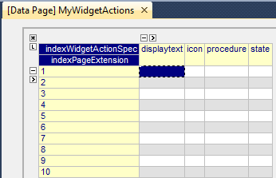

Add the details for the widget actions you would like to show for the widget. For example: 

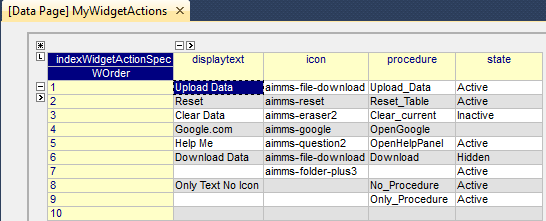

To activate the widget actions on a widget, go to the respective widget's settings by clicking on the |cog-widget| in the widget header. Click on the Widget Extensions tab. Add the string parameter in the Widget Actions field using the identifier selector.

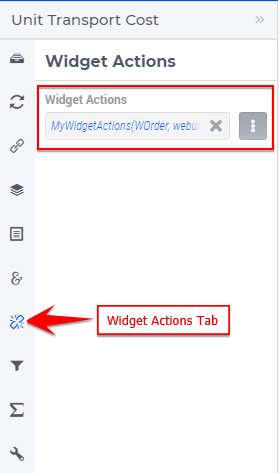

You will notice the |widget-action-nohover| icon on the widget and when you hover over the icon it highlights |widget-action| and when you click it you will see the configured widget actions.

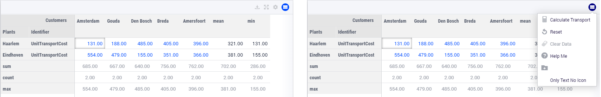

.. note::
    Widget Actions can be configured for the `Table <table-widget.html>`_, `Bar Chart <bar-chart-widget.html>`_, `Line Chart <line-chart-widget.html>`_, `Gantt Chart <gantt-chart-widget.html>`_, `Bubble Chart <bubble-chart-widget.html>`_, `Pie Chart <pie-chart-widget.html>`_, `Tree Map <tree-map-widget.html>`_, `Multiselect <selection-widgets.html>`_, `Slider <slider-widget.html>`_, `Legend <selection-widgets.html>`_, `Map <map-widget.html>`_ and `Scalar <scalar-widget.html>`_ (except in Compact Mode) widgets.

Interacting with Widget Actions
+++++++++++++++++++++++++++++++

The widget action menu can be opened and closed by clicking on the |widget-action| icon on the widget header. When the menu is open and you click anywhere outside the menu or on any other widget, the menu will close.

To select any of the widget actions, just click on the respective action. You will not be able to click an inactive action; the cursor will also indicates this.

Please notice the different combinations in the widget action menu.

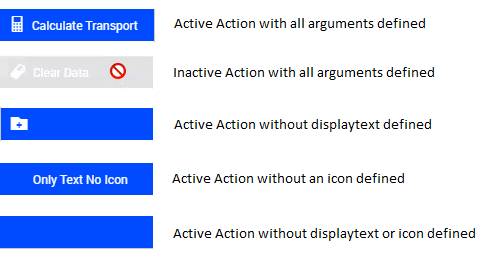

If a procedure is not defined for a certain action, clicking on the action will result in a "No action specified" error.

In case you have a long ``displaytext`` for an action, the widget action menu will stretch to a width of 2 columns and ellipsis the text that does not fit. Hovering over the action will show the complete text in the tooltip.

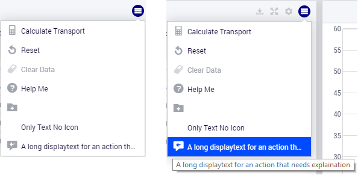

Upload and Download Procedures
++++++++++++++++++++++++++++++

As described above, the actiontype for a widget action can be either procedure, upload or download (since AIMMS 4.96; previously the actiontype setting was not present). When specifying procedure (or leaving the actiontype empty), you should provide a procedure without arguments, which will be executed as described in the section above. 

If you specify either an upload or a download actiontype, you should provide a special procedure which takes care of preparing a download file, or post-processing an upload file. Such procedures are exactly the same as the `procedures used for the Upload widget <upload-widget.html#creating-an-upload-widget>`_ and the `procedures used for the Download widget <download-widget.html#creating-a-download-widget>`_, respectively.

The upload and download process works the same as it does with the separate Upload and Download widgets. The main advantage of doing the upload or download from a widget action is that is saved the space of the official widget on your page. Another advantage is that it is immediately clear that the upload or download action is relevant for the specific widget for which you have defined such a widget action.

Item Actions
------------

.. important:: 
    Item Actions are available in software versions from AIMMS 4.74 onwards. 

When using the right mouse button on an item in a widget, a menu can appear with different actions depending on the context. In UI design this is often called a contextual menu. In AIMMS WebUI, we use the term **Item Actions** to create a link with Widget Actions and `Page Actions <page-settings.html#page-actions>`_.

Item Actions are a set of actions/procedures that can be defined via the model and configured for identifiers that are specified for a widget. These item actions are displayed when the user performs a right-click on the data elements in the widget. Item actions are defined per identifier and the right-click item action menu only appears on the data element associated with that identifier.  

Item Actions give users quick access to frequently used commands related to the selected item.

By default, Item Actions are hidden from view and there is no way for users to know if Item Actions are configured for a widget or not. Especially when the feature is new, the users will not yet expect it to be there. It is therefore wise to mention it in the documentation or the onboarding for your app. On the page inside the app itself it can be mentioned in the Help sidepanel.

The right-click item action menu displays up to 10 actions. In case you configure more than 10, only the top 10 active and/or inactive actions will be displayed.

The item actions can be associated with any procedure in your model. For example: Resetting data, Saving data, etc.

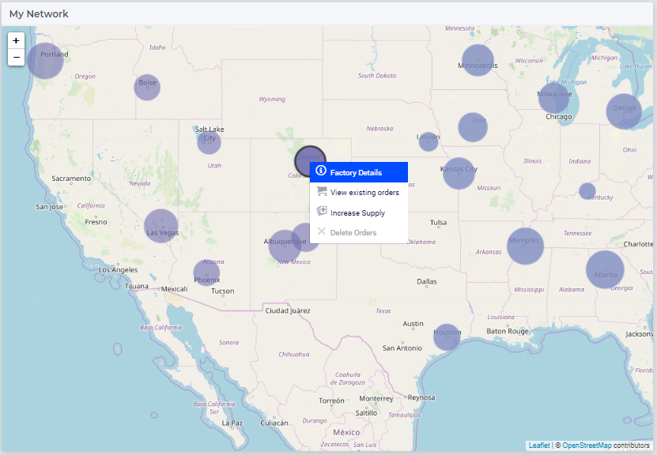

Configuring Item Actions
++++++++++++++++++++++++

Item Actions can be configured by the application developer via the AIMMS model, similarly to how widget actions are configured. This includes the actiontype specification, as available in AIMMS from version 4.96 onwards.

To configure item actions, create a string parameter indexed by the set ``webui::WidgetItemActionSpecification`` with the index ``webui::indexWidgetItemActionSpec``, the set ``webui::ExtensionOrder`` with the index ``webui::indexPageExtension``, and 
the set ``webui::WidgetActionSpecification`` with the index ``webui::indexWidgetActionSpec``; for example, a string parameter as shown here:

``MyItemActions(webui::indexWidgetItemActionSpec,webui::indexPageExtension,webui::indexWidgetActionSpec)`` 

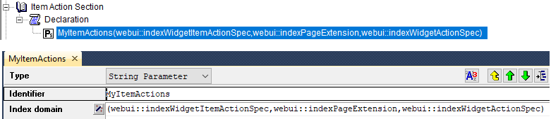

Note that, starting from AIMMS 4.92, the second index above may also be any index in a sub-set of the Integers.

You can double-click the created string parameter, open its data page and enter or modify its data values (you do need to save your model data after that):

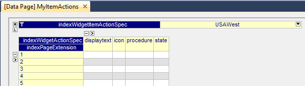

Select the identifier that you want to define the item actions:

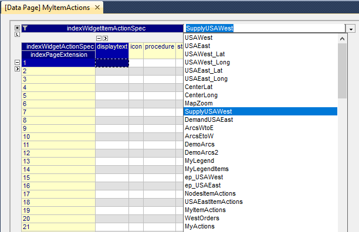

Add the details for the item actions. In the illustration below we are adding four item actions to the identifier ``SupplyUSAWest(usw)``.

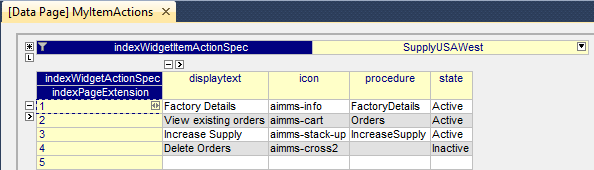

Similarly, you can add item actions to other identifiers as well. As illustrated below, we have added 3 item actions to the identifier :token:`DemandUSAEast(use)`.

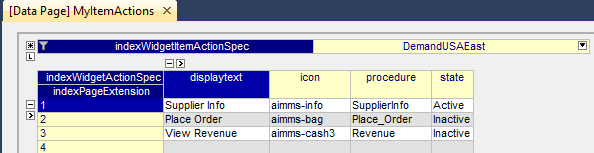

To activate the item actions on a widget, go to the respective widget's settings by clicking on the |cog-widget| in the widget header. Click on the Widget Extensions tab. Add the string parameter in the Item Actions field using the identifier selector.

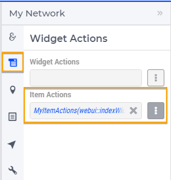

Once the string parameter is added, right-click on the element and the item action menu will be displayed.

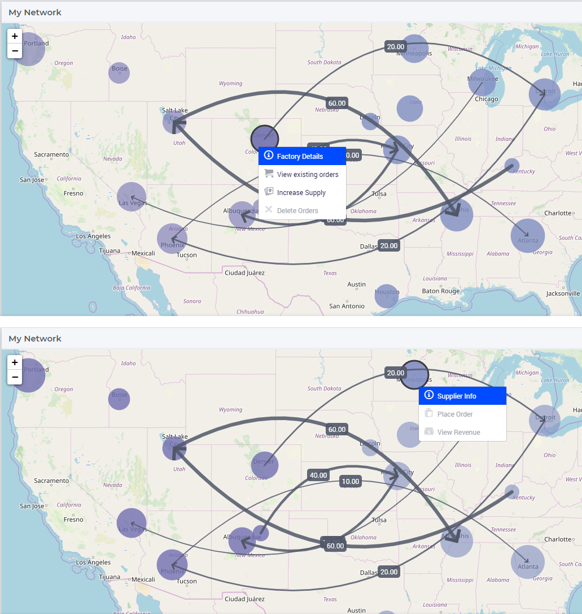

In the illustration above, the two identifiers :token:`SupplyUSAWest(usw)` and :token:`DemandUSAEast(use)` are specified as the Size identifier for their respective node sets. Hence, you can see the respective item actions appear for the nodes. 

.. important::
    In the map widget, for node sets, you can configure the item action to either the identifier that will be specified as the Size of the node set or the set used to define the node set. If item actions have been defined for both the size identifier as well as for the set, the item actions configured for the size identifier will be considered.
    For arc sets, item actions need to be defined on the identifier specified as the Value for the arc set. 

    To configure Item Actions for the Gantt chart the actions should be added to the identifier that is used as the Duration property in the Gantt chart settings.
    
    To configure Item Actions for the Bubble chart the actions should be added to the identifier that is used as the Size property in the Bubble chart settings.

You could also define different item actions for the same identifier but in two different string parameters and configure each of those string parameters to different widgets.

.. note::
    For the right-click item action menu to appear you will need to ensure that the widget contains the identifier for which the item actions were configured in the string parameter.

.. note::
    Item Actions can be configured for the `Table <table-widget.html>`_, `Bar Chart <bar-chart-widget.html>`_, `Line Chart <line-chart-widget.html>`_, `Gantt Chart <gantt-chart-widget.html>`_, `Bubble Chart <bubble-chart-widget.html>`_, `Pie Chart <pie-chart-widget.html>`_, `Tree Map <tree-map-widget.html>`_, `Map <map-widget.html>`_ and `Scalar <scalar-widget.html>`_ widgets.

Interacting with Item Actions
+++++++++++++++++++++++++++++

The item action menu can be opened by right-clicking on the data elements in the widget. When the menu is open and you click anywhere outside the menu or on any other widget, the menu will close.

.. note::
    If the <IDENTIFIER-SET> index is pivoted on the Totals partition the item actions menu cannot be displayed since the identifier cannot be uniquely determined.

Please note that when you right-click on a data element to reveal the item action menu, that element will get selected. If any store focus has been defined for the widget, the respective element parameter will also be updated.

To select any of the actions, just click on the respective action. You will not be able to click an inactive action; the cursor will also indicate this.

Please notice the different combinations in the item action menu.

If a procedure is not defined for a certain action, clicking on the action will result in a "No action specified" error.

When Item actions are configured for a widget the default right-click menu for the browser will not be displayed in that widget.

In the case of the table and scalar widgets, when the cell is in edit mode (the user double-clicks the cell or is entering any data in the cell) the item action menu will not be displayed. 

In case you have a long ``displaytext`` for an action, the item action menu will stretch to a width of 2 columns and ellipsis the text that does not fit. Hovering over the action will show the complete text in the tooltip.

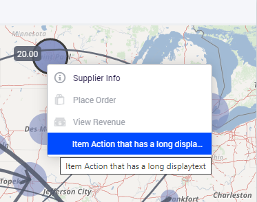

Best Practices for Item Actions
-------------------------------

* Include only commands that have a direct relation to the selected item. For example when doing a right click on a Distribution Center on a map, “Exclude From Forecast” has a direct influence on the node, while “Save Scenario” does not.
* Text for actions should be clear and concise.
* Use verbs and verb phrases for menu items that initiate actions. Describe the action that occurs when the item action is chosen, such as Consider or Exclude. This avoids confusion compared to Considered and Excluded. Is Excluded the state it is now, or is this what occurs when clicking the action?

    .. image:: images/ItemActions_YesNo1.png
             :align: center

* Refrain from using articles in menu item titles. For example, use Place Order instead of Place an Order, or Increase Capacity instead of Increase the Capacity. Articles rarely add value and make the text longer.
* Use title case. The convention for AIMMS is to use Title Case in words. Sticking to this convention gives users a consistent experience.

    .. image:: images/ItemActions_YesNo2.png
             :align: center

* Use adjectives or adjective phrases for Item Actions that toggle item states. Describe the attribute the action affects. Adjectives appearing in menu item titles imply an action and can often fit into the sentence “Change the selected object to…”—for example, *At Capacity* or *Closed*.
* Use an ellipsis whenever choosing a menu item requires additional input from the user. The ellipsis character (…) means a dialog or separate window will open and prompt the user for additional information or to make a choice.
* Disabled state is an item that is greyed out and gives a not-allowed pointer when hovered. This can be because the item is currently unavailable until a certain condition is met. Another use case can be for toggling between options, where the currently active option is disabled.

    .. image:: images/ItemActions_DisabledAction1.png
             :align: center

.. note:: 
    Most of these best practices also apply to Widget Actions.

    Some content of this guide is taken from the Apple Human Interface Guidelines. These guideline provide a wealth of information on human-computer interactions.

.. spelling:word-list::

    actiontype
