.. |cog-widget| image:: images/cog-widget.png

Widget Options
==============

The ‘cog wheel’ button |cog-widget| (in the upper right corner of a widget) will open a popup window that allows you to change the options for the widget. 

.. image:: images/identifier-settings-options-editor.jpg
    :align: center

This Option Editor consists of several tabs. It depends on the widget type which tabs are available. Tabs that are available for most of the widgets are:

.. contents:: Widget Options List
    :local:
    :depth: 1

.. tip::
    Option changes are automatically saved to the WebUI Server.
    
Pivot
-----

You can pivot the indices in most of the widget types. E.g. you can change which indices should appear in the row or column of a Table widget, or which index should be stacked in a Bar Chart widget. To pivot indices, you should open the `widget options <#widget-options>`_ and go to the Pivot tab:

.. image:: images/pivot.png
    :align: center

There you can drag-and-drop the indices to the different areas in your widget. E.g. in case of a Table widget, to the *Rows*, *Columns* or *Totals* area.

Change Type
-----------

You can use all kind of widgets to display your AIMMS data. By changing the type of a widget, you can easily switch between e.g. a table or a chart, without creating a new widget for that. To do so, you should open the `widget options <#widget-options>`_ of your widget and go to the Change Type tab. There you will see the possible types to which you can switch.

Store Focus
-----------

Some WebUI widgets offer you the possibility to store the (combination of) element(s) that currently have focus in the widget. E.g. in the Table widget you can store the focus cell, in the Bubble chart widget you can store the focus bubble. In WinUI you have similar functionality like this, called 'Reverse Link'. Specifying the Store Focus option opens up all kinds of interactive opportunities. E.g. by changing the focus cell in a table, other widgets could display relevant information for that specific cell.

At the *Store Focus* tab in the `widget options <#widget-options>`_ you will see a list of indices. For each index you can specify the element parameter that should be filled with the element that has the focus in the widget. 

.. image:: images/storefocus.png
    :align: center
    
The list of indices also includes an index referring to IDENTIFIER-SET. You can specify an element parameter over the set AllSymbols there. This allows you to also store the identifier that currently has focus in the widget. This could be relevant when you display multiple identifiers in your widget.

Contents
--------

At the Contents tab of the Widget Options, you can specify for which AIMMS identifier(s) the widget should show the data. 

.. image:: images/contents-tab.png
    :align: center

You can change the *Current Contents* by searching for a specific identifier at *Available Data*. By clicking on the identifier, it is added to the *Current Contents* list. In case only one identifier is allowed for a specific widget, adding another identifier will delete the previous identifier from *Current Contents*. If multiple identifiers are allowed in a widget type, adding an identifier will extend *Current Contents*. 

You can delete an identifier from *Current Contents* by clicking on the cross on the right of it. You can re-order the identifiers at *Current Contents* by drag-and-drop, or by clicking on the triangles in front of the identifier.

.. tip::

    In case you cannot find the identifier that you are looking for at *Available Data*, you might need to make sure that the identifier is in the set AllPublicIdentifiers.

Additional identifier properties
++++++++++++++++++++++++++++++++

For every identifier that you have specified as part of the _Current Contents_ option in your widget you can specify additional identifiers in AIMMS to specify additional properties for each identifier. For a given identifier :token:`X` you can specify (create in AIMMS)

* :token:`X_annotations` to hold annotations that are put as CSS classes on associated DOM elements in your model. See the `Data-Dependent Styling <folder.html#data-dependent-styling>`_ section for more details.
* :token:`X_flags` to make updatable identifiers appear as read-only in the WebUI.  See the `Data-Dependent Styling <folder.html#data-dependent-styling>`_ section for more details.
* A procedure named :token:`UponChange_X`, which will automatically be run whenever the value of identifier :token:`X` is changed from within the WebUI. AIMMS accepts 
  two forms of an UponChange procedure:

    * a procedure without arguments. You can use this form if you are not interested in the which particular values changed, but do want to get a notification that a change took place
    * a procedure with two arguments, both with the same domain as the identifer :token:`X`. The first argument should be a numeric parameter, and will hold a 1 for each tuple that was changed. The second argument should have the same type as the :token:`X` and will hold the old value for such a tuple, the changed value can be obtained via :token:`X`. 
    
  The latter form can be used, for instance, to detect which tasks in a Gantt chart has moved, or to act upon a block edit in a table.
  
* :token:`X_text` to hold additional text to be shown within the DOM element associated with a data tuple. This option is currently only supported by the Gantt chart. The CSS classes defined via the annotations identifier of the identifier :token:`X` itself will also be set for text displayed in the associated DOM element. You can use this, for instance, to change the styling of the displayed text of elements you want your end-users to pay extra attention to. 
    
    * For the Gantt chart, you can set CSS for the task text via ``.tag-ganttchart .label``, possible compounded with the additional CSS classes set via the annotations identifier of the <duration> parameter.

* :token:`X_tooltips` to hold a string representing some (additional) info which may be displayed in a tooltip associated with the identifier :token:`X` used by a widget 
	
	
Adding Tooltips
---------------

Almost all widgets offerred by the AIMMS WebUI support tooltips. These tooltips have some default value. For example, when hovering over a Table cell, its value is displayed. 
However, they can also be completely user-defined, giving the user maximum freedom in determining the contents to be shown. 
In order to create your user-defined tooltips, you should add an auxiliary string parameter to your AIMMS model, called :token:`X_Tooltips`, where :token:`X` is the name of 
an existing identifier that is displayed in the widget(s) for which you want to override the default tooltips. This auxiliary identifier must have the same index domain 
as the corresponding model identifier. For example, consider the following table, which shows aircraft types for specific flights:

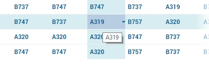

As you can see, hovering over the cell with value 'A319' just shows this value in the default tooltip. In order to change that, in addition to the displayed :token:`AircraftType(a1, a2, dt)` identifier, the auxiliary :token:`AircraftType_Tooltips(a1, a2, dt)` identifier is added to the model. When using the following definition:

.. code::

    FormatString("Flight from %e to %e is operated by the %e aircraft type", a1, a2, AirCraftType(a1, a2, dt))

the result when hovering over the same cell as above looks like this:

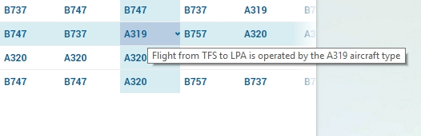

.. warning::
   **Security Warning:** 
   Putting javascript code in an identifier (like :token:`X_Tooltips`) with write-permission from multiple users (like in `CDM </cdm>`_)
   would allow a malicious user to do `Persistent XSS <https://en.wikipedia.org/wiki/Cross-site_scripting#Persistent_(or_stored)>`_.
   For example a malicious user could record all actions done by another user.	
	
HTML Tooltips
-------------

Besides the simple text-based tooltips illustrated above, one may also use HTML-based tooltips, which allow to display more sothisticated contents when hovering over the data entries in a widget.
In this case the data of the string parameter :token:`X_Tooltips` (associated with an identifier :token:`X`) must be in HTML format; for more info on HTML, 
see for example `html.com <https://html.com/>`_ or `www.w3schools.com <https://www.w3schools.com/html/>`_ .

Next we illustrated this feature based on some concrete examples.

Suppose the data of a 2-dimensional parameter DailyNumberOfPassengers(i1,i2) is shown in a table widget, where i1 and i2 are alias indexes in a set Islands. 
One can declare the string parameter DailyNumberOfPassengers_Tooltips(i1,i2) and defined its HTML data as

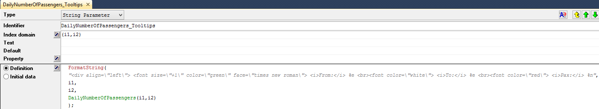

In this case the tooltip for a cell in the table looks like in the following picture:

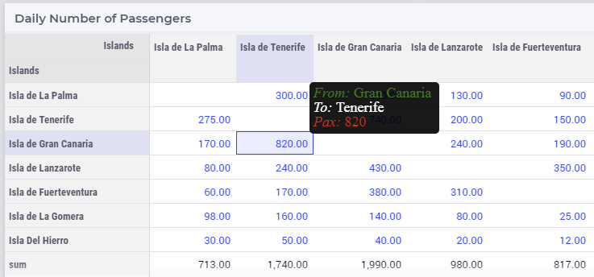

.. note::
   Where in a simple text-based tooltip you used \\n to move to a new line, in a HTML-based tooltip this needs to be replaced by  , see example above.
   Similarly, the usage of \\t in text-based tooltips should be replaced by HTML tables, see further below.

Next, suppose that the data of a 1-dimensional parameter TotalCostPerIsland(i) is rendered in a barchart widget. A HTML-based tooltip may be added by the string parameter
TotalCostPerIsland_Tooltips(i) defined as

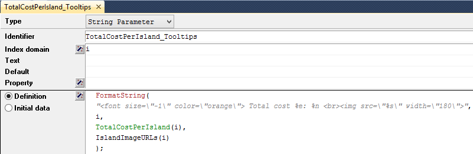

where for each element i of a set Islands, IslandImageURLs(i) is a string parameter holding the web URL of a corresponding (island) image. 
	
In this case the tooltip for a bar in the chart looks like in the following picture:

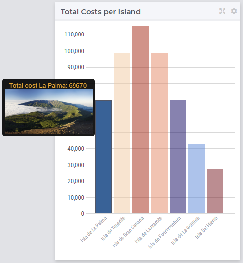

Of course, one can easily change type of the widget to linechart, piechart, or treemap, and the same tooltip contents may be used for these widgets as well:

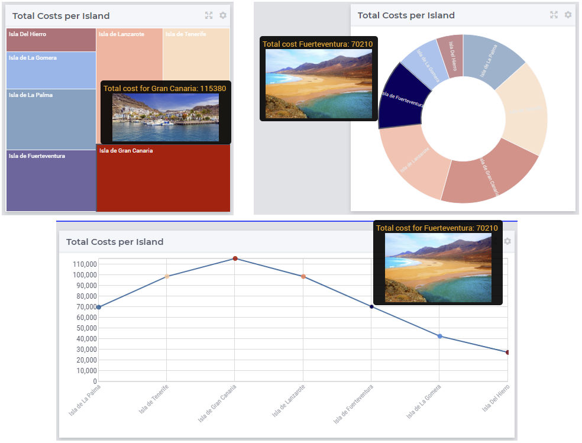

In case the costs for all islands were aggregated in a scalar parameter TotalCostALLIslands which is the shown in a scalar widget, a similar HTML-based tooltip may be added as well. 

 

Filters
-------

The WebUI widgets offer the possibility to specify one or more filters for their data. These filters are widgets as well. Widgets that can be used as filters for other widgets are the Multiselect widget, the Selectionbox widget, the Legend widget and the Table widget.

.. image:: images/filterdialog.jpg
    :align: center

In the filter dialog displayed in the image above, the widgets  that can act as a filter and which are on the same page as the current widget, are listed. You can select the ones that you want to use as a filter for the current widget, by clicking on them. Obviously, the contents of the widget used as a filter should at least contain an index which matches an index in the content of the widget to be filtered in order to yield any effect.

Using a Multiselect widget as a filter
++++++++++++++++++++++++++++++++++++++

If you use a Multiselect widget as a filter for another widget, the one-dimensional binary parameter that serves as the content of the Multiselect widget will be used as a filter for your widget. For example, if your widget is displaying data over an index :token:`i`, and the Multiselect widget contains a one-dimensional binary parameter over this index :token:`i`, your widget will only display data for the index values of :token:`i` that are selected in the Multiselect widget. This way, you can for example restrict the number of bars in a bar chart, or the number of bubbles in a bubble chart, the number of rows in a table widget, ...

Using a Selectionbox widget as a filter
+++++++++++++++++++++++++++++++++++++++

The Selectionbox widget used as a filter acts about the same as using a Multiselect widget. The one-dimensional parameter which serves as the content of the Selectionbox, will filter the data in your widget just as in the Multiselect case. In this case, though, your widget will only display data for the one value that you select using the selectionbox.

Using a Legend widget as a filter
+++++++++++++++++++++++++++++++++

Using a Legend widget as a filter is similar to using a Selectionbox widget. It also restricts the filtered widget to display data for exactly one value that you select in the Legend widget.

Using a Table widget as a filter
++++++++++++++++++++++++++++++++

The Table widget is a slightly more complicated widget type to use as a filter. It restricts the filtered widget to only display data for which the corresponding identifier(s) in the Table widget show(s) data. This means that, in case you display sparse data in your Table widget, those columns and/or rows which only contain default values in the Table (and are thus not displayed), are also filtered out in the filtered widget. So, suppose you show a bar chart with data for certain aircraft types, which is filtered by a table that only contains default values for a certain aircraft type, the bar for this particular type will also not display in the filtered widget.

Combining filters
+++++++++++++++++

It is possible to combine filters as well. You can just select more than one filter for your widget. Of course, it depends on your specific widgets what effect this has on the filtered widget. 

Totals
------

You can add aggregators to most widget types. To do so, open the `widget options <widget-options.html>`_ and go to the Totals tab:

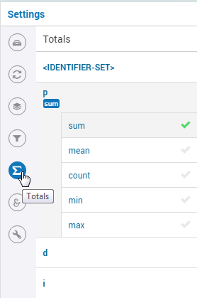

For each index in your widget, you can turn on several aggregators, like: sum, mean, count, min, max. Adding these totals will result in extra data in your widget.

Identifier Settings
-------------------

The various widget types in the WebUI offer the possibility to specify settings for identifiers that are specific for the widget at hand. Currently, in the Identifier Settings options editor, you can specify the `Display Domain <#display-domain>`_ and `Slicing <#slicing>`_ for each identifier that is specified in the `Contents <#contents>`_ section of the widget:

.. image:: images/identifier-settings-set-slicing-per-index_v1.png
    :align: center

Display Domain
++++++++++++++

Sparse vs. Dense
^^^^^^^^^^^^^^^^

In both AIMMS and the WebUI, the data is displayed in a sparse manner by default. In the WebUI, this means that, for example, a Table widget showing an identifier that has a complete row or a complete column with only default (0) values, does not display such a row or column at all. When merely displaying your data, this is usually convenient, but if you want to edit your data, it becomes hard if the row/column that contains the default (0) value that you want to edit is not displayed at all. For such situations, it makes sense to display the data in a dense way.

Specifying Display Domain
^^^^^^^^^^^^^^^^^^^^^^^^^

In order to provide you with control over the sparsity pattern of your widget data, you can specify a so-called *display domain* for each identifier that is present in your widget:

.. image:: images/identifier-settings-options-editor.jpg
    :align: center

The domain that you enter in the options editor above, can be an identifier, or, in its simplest form, just a 0/1 value:

* Specifying no value at all (the default situation) means that  the identifier displays in a sparse way, i.e. only the rows/columns containing non-default values are displayed.
* Specifying a value of 0 means that the identifier displays nothing at all.
* Specifying a value of 1 means that the whole identifier will always be displayed, even if it only contains default values.

You can obtain a more fine-grained level of control by specifying an *identifier* which contains a sparsity pattern.

Examples
^^^^^^^^

To illustrate the above, here are some examples that show the difference between all usages of the display domain, applied to the same table. This table contains two columns and a number of rows containing checkboxes.

First, here's the table, with the display domain not specified at all (i.e. the default behaviour) *and* the table containing only 0 values:

.. image:: images/tableonlyzeroesnodd.jpg
    :align: center

As expected, no rows are displayed at all here, which makes it impossible to change any value. To overcome this, we can set the display domain of the first identifier to 1, which leads to the following table:

.. image:: images/tableonlyzeroesdd1.jpg
    :align: center

As you see, editing the values is possible now. Checking a number of checkboxes could for example lead to the following table (with the display still set to 1):

.. image:: images/tablesomevaluesdd1.jpg
    :align: center

Now let's remove the '1' again for the display domain of both identifiers and set it to its default value (i.e. not filled in):

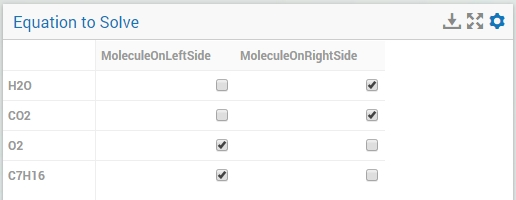

As you can see, now only the rows (and columns) which contain non-zero values are displayed. To illustrate the effect of specifying an identifier for the display domain, the following table shows what happens to the table if we create a binary identifier :token:`MoleculeDisplayDomain(m)`, with the following definition:

.. code::

    if StringOccurrences(m, "O") then 1 else 0 endif;

In English, this means: for all rows for which the molecule :token:`m` contains the symbol :token:`O` (oxygen), the display domain should be set to 1. If we fill in this identifier for the display domain option, the table changes as follows:

.. image:: images/tablesomevaluesddidentifier.jpg
    :align: center

As expected, this table only shows the rows for which the molecules contain an O in their name, regardless of the value of their associated checkboxes (note the non-displayed row for the C7H16 molecule!). Specifying an identifier for the display domain is the most flexible way of determining the display domain. You can also use it to only display a slice of a displayed identifier, by only setting the associated display domain identifier to 1 for a specific value of one of its indexes.

.. tip::
    
    Please be aware that if you specify an identifier here which is defined over a subset, you should define the display domain identifier over the same subset (and not the master set).

Slicing
+++++++

Identifiers in AIMMS can have multiple dimensions. You can specify these dimensions in AIMMS via the index domain of an identifier. These identifiers can be displayed in the WebUI and their data is shown over all these dimensions  by default. However, there are also cases where you only want to see part of the dimensions/data. In situations like this, you can slice the indices of one or more identifiers in your widget. This can be done by the 'Set slicing per index' option at the `Identifier Settings <#identifier-settings>`_ tab of the `Widget Options <widget-options.html>`_.

.. image:: images/identifier-settings-set-slicing-per-index_v1.png
    :align: center

Set slicing per index
^^^^^^^^^^^^^^^^^^^^^

For each identifier in the widget, you can specify a separate slicing. To do so:

#. On top of the Identifier Settings tab, select the identifier that you want to slice. 
#. At 'Set slicing per index' you select the index that you want to slice (every index can have its own slicing). 
#. Specify the 'Slice type' that you want to apply for this index. 
#. Specify the corresponding 'Slice value'. 

Slice type and Slice value
^^^^^^^^^^^^^^^^^^^^^^^^^^

You can select from three different types of slicing, with corresponding slice values:

* **Index** - You can slice the selected index to another (related) *index*. At 'Slice value' you can then select from all indices that have the same rootset. Slicing to a different index is useful when you e.g. only want to see a subset of the elements of the original identifier, in which case you would slice to an index of a subset of the original index.
* **Element Parameter** - You can slice the selected index to a (related) *element parameter*, which you can specify as the 'Slice value'. The selected index is then fixed to the current value of the selected element parameter. The widget will show the data of the identifier, only for the element in the element parameter for the selected index.
* **Fixed Element** - You can slice the selected index to a *fixed element*, which you can specify as the 'Slice value'. The selected index is then fixed to the selected literal element value. The identifier data will only be displayed for the selected element for the selected index.

Index
^^^^^^

When selecting an index in the index selectionbox, you can also see an overview of how all the indices in your widget are sliced. E.g. in this picture, you can see that there are 2 indices, both sliced. The first index, l, is sliced to the Element Parameter (EP) 'ThisLocation'. The second index, iLonLat, is fixed to element 'Lon'.

.. image:: images/slicingatindices_v1.png
    :align: center

Clear slicing
^^^^^^^^^^^^^

To easily clear the slicing of an identifier for all its indices, you can press the 'Clear slicing for this identifier' button. Of course you need to make sure that you have selected the identifier for which you want to clear the slicing in this widget.

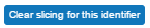

.. important::

    Some of the widgets require multiple identifiers as input (contents). When you slice one or more of these identifiers, you need to make sure that the resulting index domains match.

.. tip:: 

    Whenever you slice one dimension (index) of an n-dimensional identifier to a *fixed element* or *element parameter*, its dimension will become n-1. This is good to realise, as some widgets require identifiers of a certain dimension. E.g: In the map widget, the arcs identifier needs to be two-dimensional over the set *nodes x nodes*. Whenever you slice one dimension to a fixed element (or element parameter), you effectively loose a dimension and it becomes impossible for the map widget to map data to arcs. As a work around you can consider to create a set containing a single element and use subset slicing here: whenever you do subset slicing, the dimension of the data that is displayed, is not reduced. 
	

Please mind when slicing over a subset in a table, other identifiers defined over the corresponding superset are considered as defined over a different set. Thus you might end up with the following unexpected behavior: 
	
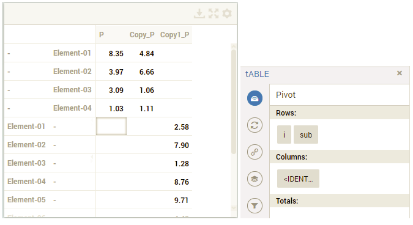
	
Where slicing all your identifiers (not just one) over the same subset will fix the display:
	
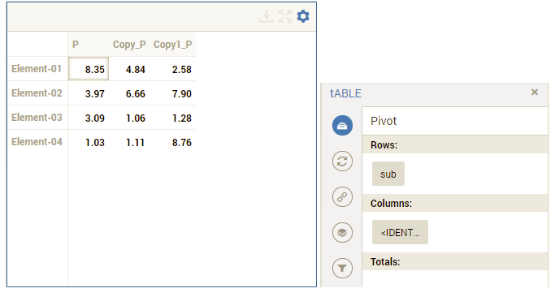

Examples
^^^^^^^^

The transport table is not sliced. All non-default data is displayed.

.. image:: images/slicingexample-noslicing.png
    :align: center

The transport table is sliced to show the transport from a single selected factory (via element parameter) to all locations.
    
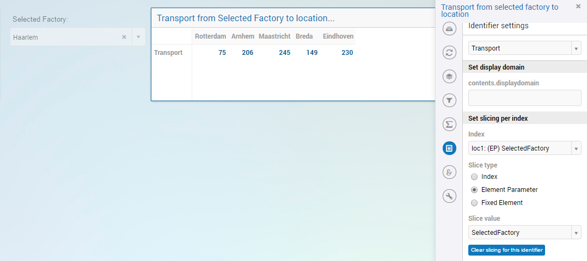

The transport table is sliced to show the transport from all distribution locations (subset with index distr) to the fixed location (fixed element) 'Breda'.
    
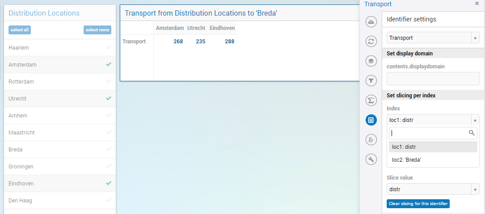

	

Hiding Widgets
--------------

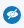

There are situations where you may want to hide certain widgets for certain users. Especially if many 'roles' can be identified among the users of your applications, this may apply: for some users, data displayed in a particular widget is of no interest, while for others it is.

To help you in situations like this, every widget has an option called *Visible*, located on the *Miscellaneous* tab in its option editor. Setting this option to False (or 0) has the effect that the widget is not visible anymore. In order not to lose track of these widgets while developing your WebUI, there is an 'eye' icon |eye-blue| in the top bar, with which you can still show the hidden widgets. These are displayed in grey, in order to distinguish them easily from the visible widgets. This icon is not visible when running your WebUI app in a PRO environment (i.e. in the end-user scenario), or when you have no widgets that have the Visible option set.

It is not only possible to just specify literal values like True/1 or False/0 for the 'Visible' option: you can use any scalar AIMMS parameter that you like. This is especially powerful, since it allows you to steer the visibility of each and every widget using whichever logic you want. As an illustration, you could create an AIMMS parameter like:

.. code::

    if CurrentUserGroup = 'Finance' or CurrentUserGroup = 'Management' then 
        1 
    else 
        0 
    endif; 

to make sure that only finance people and people from the management can see one or more specific widgets.

.. important:: 

    Please note that if you want to make sure that *not* all your users can see all available data (e.g. because some of it is confidential), hiding certain widgets is not sufficient. Users can still create new widgets for showing all available data. To avoid this, you need to adapt the set `AllPublicIdentifiers <creating.html#public-identifiers>`_, such that it only contains the identifiers that the current user is allowed to see. Furthermore, you need to make sure that users cannot edit the parameter that you specified for the Visible option (e.g. by giving it a definition).

Number of decimals
------------------

You can change the number of decimals for a widget:

* Open the `option editor <widget-options.html>`_ for the widget
* Go to the *Miscellaneous* tab, and
* Change the *Decimal Points* option.

The number of decimals displayed has a limit, the **default** is 2 decimals.

